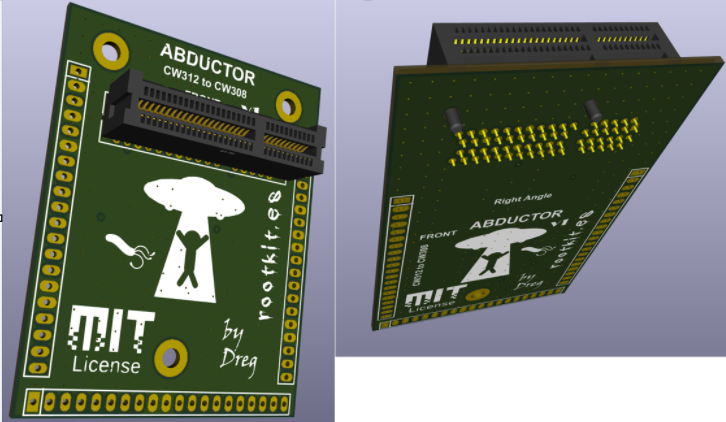

# Abductor

An adapter board that lets you run CW312-format targets on the ChipWhisperer CW308 UFO.



I made two versions: one with a right-angle connector and one without. 

----

### Don't even think about manufacturing this yet. I'm still testing it, and the final design may change. This repository is for informational purposes only for now.

It's always better to design a custom target board for each specific use case... but when we don't want to (or simply can't) this could be a crap solution.

----

Forum: https://forum.newae.com/t/abductor-a-cw312-to-cw308-ufo-adapter-board/6514

The CW308 UFO and the CW312 target family use different physical interfaces. The UFO expects targets on its pin-header target socket, while CW312 boards plug into a card-edge slot. The Abductor bridges the two: it exposes the full UFO target footprint on one side and a CW312 card-edge connector (Samtec MECF family) on the other, handling the signal mapping in between, so any CW312 target drops straight onto the UFO.

Fitting the UFO theme, the name says it all. The UFO abducts the CW312 target, pulling it in so it can run on the CW308 platform.

# KiCad v10 deps

### I'm not a KiCad user, so I made some crap haha

- https://github.com/dobredanielstelian/ViaStitching

- pip install easyeda2kicad

```
python -m easyeda2kicad --full --lcsc_id=C4597619 --output "C:\\Users\\regue\\Desktop\\project" --project-relative --overwrite

python -m easyeda2kicad --full --lcsc_id=C4571870 --output "C:\\Users\\regue\\Desktop\\project\\right_angle" --project-relative --overwrite
```

# PCB

- enig
- 6 layers
- JLCPCB is cheap and has a good quality for 6 layer enig board. I used them to make the first prototypes: https://jlcpcb.com/quote

# Gerber

- Normal version: [prj/gerber.zip](prj/gerber.zip)

- Right-angle version: [prj/right_angle/gerber.zip](prj/right_angle/gerber.zip)

# BOM

## PCIE-064-02-F-D-TH (Samtec)

PCI Express/PCI Connectors 1.00 mm PCI Express(R) Gen 3 Edge Card Connector

https://www.mouser.es/ProductDetail/Samtec/PCIE-064-02-F-D-TH?qs=iT52DjcXudu3X3%2FATBSy9g%3D%3D


## PCIE-064-02-F-D-RA (Samtec)

Right Angle PCI Express/PCI Connectors 1.00 mm PCI Express(R) Gen 3 Edge Card Connector

https://www.mouser.es/ProductDetail/Samtec/PCIE-064-02-F-D-RA?qs=92ilVni64gwDtfpZKan9%2FQ%3D%3D

## MALE PINS

- 800-10-020-10-001101
- Preci-dip
- https://www.mouser.es/ProductDetail/437-8001002010001101

-----

## FEMALE PINS
- 801-87-020-10-001101
- Preci-dip
- https://www.mouser.es/ProductDetail/437-8018702010001101


