# Abductor

An adapter board that lets you run CW312-format (card-edge) targets on the ChipWhisperer CW308 UFO.
Discussion and questions on the NewAE forum: https://forum.newae.com/t/abductor-a-cw312-to-cw308-ufo-adapter-board/6514

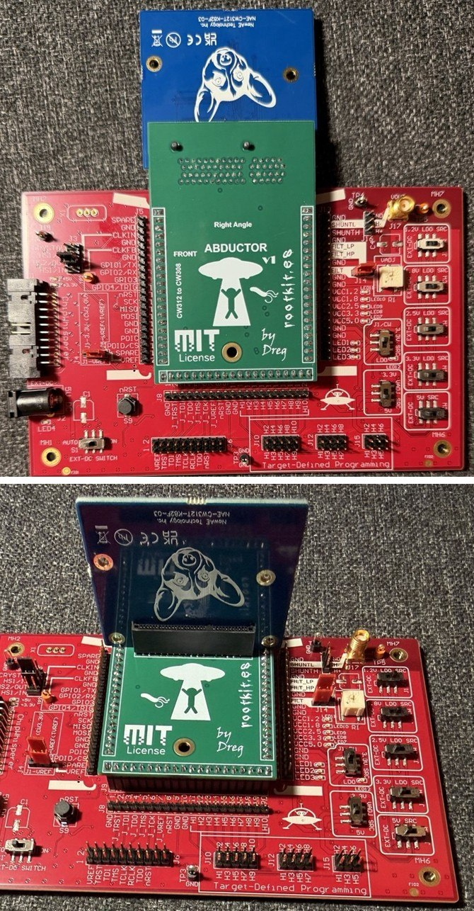

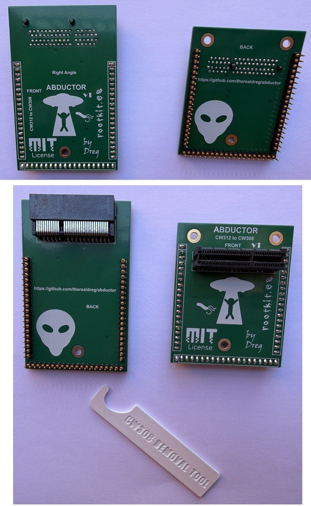

There are two versions, one with a right-angle connector and one without. A dedicated target board
designed for one specific use case is usually preferable; when that is not practical, or simply not
possible, this adapter is a low-cost alternative.

Tip: to pull boards off the CW308 UFO without stressing or damaging the PCB, I use a 3D-printed removal
tool: https://github.com/therealdreg/removal_tool_cw308_ufo_chipwhisperer

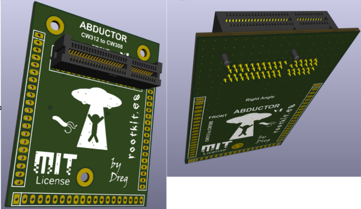

## Scope and limitations (please read first)

> I am an enthusiast, not a professional hardware or side-channel engineer. This board and its
> documentation are shared in case they are useful to someone, but they may contain mistakes, imprecise
> wording, or design choices a specialist would make differently. Treat everything here as an informal
> engineering log written in good faith, not a datasheet or a qualified test report. Before
> manufacturing the board or depending on it for anything important, review the KiCad source and the
> gerbers yourself. Corrections, reviews and feedback are genuinely welcome.
>
> Every result below comes from a single operator on a single bench, using one physical specimen of each
> board (one unit of each Abductor variant, standard and Right-Angle), one ChipWhisperer Husky Plus, and
> one of each target (CW312T-SAM4S, CW312T-iCE40UP, CW312T-K82F), at chipwhisperer commit `3c8e4347` (see
> the test bench). Most quantitative figures (SNR, TVLA t, |rho|, glitch bypass rates) are single runs
> and carry run-to-run and re-assembly variance that was not independently characterized here unless a
> sample count says otherwise; they are not multi-unit or multi-operator averages. Comparative words used
> throughout ("comparable", "consistent with", "no measurable difference") describe the specific sessions
> recorded here, not a general guarantee about the hardware. Where a result was inconclusive or a method
> was circular, it is flagged as such rather than smoothed over. On the whole, after the broad (if mostly
> single-run) testing below, I consider the electrical design validated for my own use and good enough
> for what I need it to do.

## How it works

The CW308 UFO and the CW312 target family use different physical interfaces. The UFO expects targets on
its 0.1-inch pin-header target sockets, while CW312 boards plug into a card-edge slot. The Abductor
bridges the two: it exposes the UFO target-header footprint on one side and a CW312 card-edge socket on
the other, and handles the signal mapping in between, so a CW312 target that uses the standard card-edge
interface should mount and run on the UFO. For the 1.00 mm CW312 edge the board uses a compatible Samtec
PCIE-series socket (part numbers and rationale are in the bill of materials).

Fitting the UFO theme, the name captures the idea: the UFO abducts the CW312 target and pulls it in so
it can run on the CW308 platform.

## Building the board

Everything needed to fabricate a board: the KiCad sources, the stackup and gerbers, the parts, and a note
on the small target-board trim the straight variant calls for.

### KiCad v10 sources

This is not a KiCad project I work in regularly, so please review the source files before relying on
them for manufacturing. Two plugins are used:

- ViaStitching: https://github.com/dobredanielstelian/ViaStitching (a KiCad 10 port of JS Reynaud's
  via-stitching plugin, `jsreynaud/kicad-action-scripts`)
- easyeda2kicad: install with `pip install easyeda2kicad` (uPesy's tool; output targets KiCad v6+)

The two connector footprints are imported with easyeda2kicad:

```
python -m easyeda2kicad --full --lcsc_id=C4597619 --output "C:\\path\\to\\project" --project-relative --overwrite

python -m easyeda2kicad --full --lcsc_id=C4571870 --output "C:\\path\\to\\project\\right_angle" --project-relative --overwrite
```

(LCSC `C4597619` = Samtec PCIE-064-02-F-D-TH, `C4571870` = Samtec PCIE-064-02-F-D-RA; these match the
bill of materials below.)

### PCB and gerbers

Six layers, ENIG finish. This many signals (power and shunt sensing, the HS2 clock, serial, the
crowbar/VOUT glitch path, the JTAG/SWD debug lines, the trigger, the LEDs and GPIO) route more
comfortably on six layers, which give a continuous ground plane, a power layer split into islands for the
several rails, and shorter return paths. I chose six layers for that routing headroom, not because the
data proves them necessary: at ~7 MHz the signal-integrity upside should
be small, and the A/B comparison in the results below does not show the adapter improving on a direct
connection. Whether four layers would perform the same I cannot say, since I never built one to compare.
I chose ENIG for flat, uniform pads under the 1.00 mm fine-pitch Samtec socket; this board has no
gold-finger edge of its own, so a cheaper HASL finish would most likely also work. I ordered both variants
as six-layer ENIG prototypes from JLCPCB (https://jlcpcb.com/quote), five pieces of each, and the boards
were more than suitable for the testing that follows. They came back to this spec:

| JLCPCB parameter | Value |
|---|---|
| Base material | FR-4, TG135 |
| Layers | 6 |
| Dimensions | 54 mm × 67 mm |
| Thickness | 1.6 mm |
| Outer / inner copper | 1 oz / 0.5 oz |
| Surface finish | ENIG, 1 µin gold (1U″) |
| Solder mask / silkscreen | Green / white, ink-jet |
| Via covering | Epoxy filled and capped |
| Min via | 0.3 mm hole, 0.4 to 0.45 mm diameter |
| Electrical test | Flying-probe, full |
| Appearance quality | IPC Class 2 |
| Outline tolerance | ±0.2 mm |

The value impressed me: for a six-layer, ENIG, flying-probe-tested board ordered in a small five-off
prototype quantity, the quality came out far better than I expected for such an inexpensive low-volume run,
and I was genuinely impressed by what came back.

Schematic: 

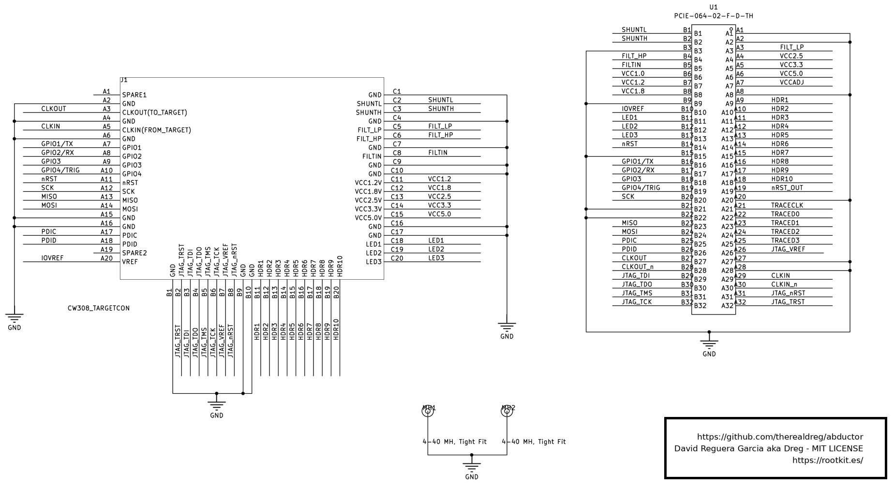

Gerbers:

- Straight version: [prj/gerber.zip](prj/gerber.zip)
- Right-angle version: [prj/right_angle/gerber.zip](prj/right_angle/gerber.zip)

### Bill of materials

NewAE does not publish a connector part number for the 1.00 mm CW312 card edge (the CW313 documentation
only calls it the "cost-optimized CW312 card edge connector"), so the parts below are a compatible
selection I chose, not an official NewAE specification.

**Card-edge socket, straight: Samtec PCIE-064-02-F-D-TH.** 1.00 mm pitch, 64-position (mechanically the
length of a PCIe x4 slot), through-hole card-edge socket from Samtec's PCIe-connector series. It is used
here purely for its mechanical fit to the 1.00 mm CW312 card edge; the connector's PCIe signaling rating
is not relevant, since this edge carries DC rails and a ~7 MHz clock, not a PCIe link. Mouser: https://www.mouser.es/ProductDetail/Samtec/PCIE-064-02-F-D-TH?qs=iT52DjcXudu3X3%2FATBSy9g%3D%3D

**Card-edge socket, right-angle: Samtec PCIE-064-02-F-D-RA.** Right-angle version of the same 1.00 mm
pitch, 64-position Samtec card-edge socket (same PCIe-connector series, again used only for mechanical
fit). Mouser: https://www.mouser.es/ProductDetail/Samtec/PCIE-064-02-F-D-RA?qs=92ilVni64gwDtfpZKan9%2FQ%3D%3D

**Male header: Preci-dip 800-10-020-10-001101.** 20-pin, 2.54 mm machined pin strip. Mouser: https://www.mouser.es/ProductDetail/437-8001002010001101

**Female socket strip: Preci-dip 801-87-020-10-001101.** 20-pin, 2.54 mm machined socket strip; the same
20-pin header NewAE specifies for the CW308. Mouser: https://www.mouser.es/ProductDetail/437-8018702010001101

### Target-board clearance (straight variant only)

On the **straight** Abductor, a small corner of the ChipWhisperer CW312 target board fouls the adapter
when the target is seated, so that corner of the **target board** has to be trimmed off. The photos below
show it on a CW312T-K82F target: the corner is nipped with flush cutters and the edge sanded, away from
the target's mounting hole. This is not an Abductor design flaw and cannot be designed out of the adapter,
because the collision is with the official ChipWhisperer target boards, which are fixed products you
cannot redesign; on the straight variant you simply remove that small corner from each target once. It is
a minor, one-time step, not a drama. The **Right-Angle** Abductor does not need it: its right-angle
connector seats the target clear of the adapter, so no target has to be trimmed.

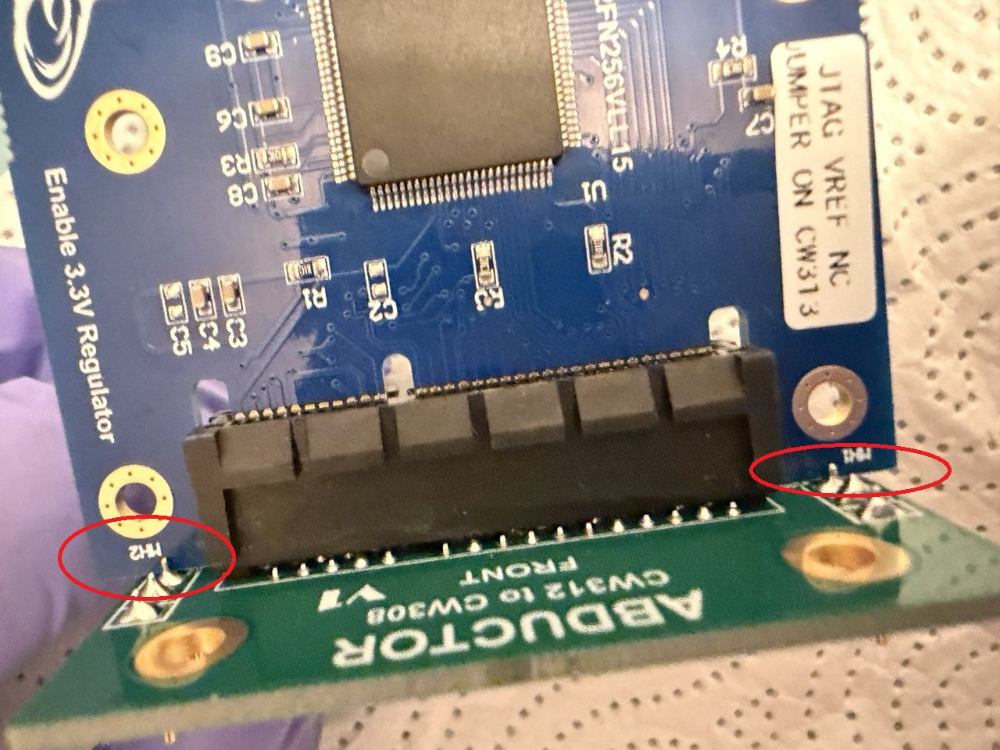

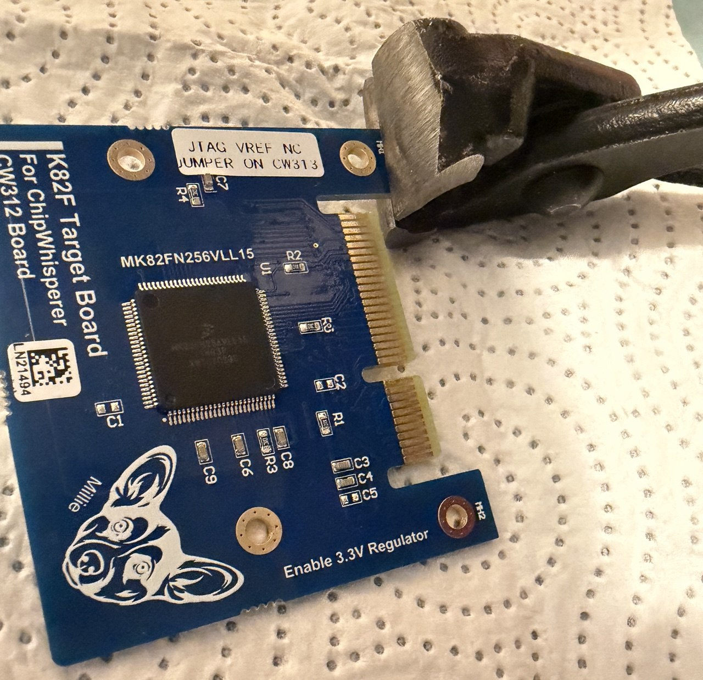

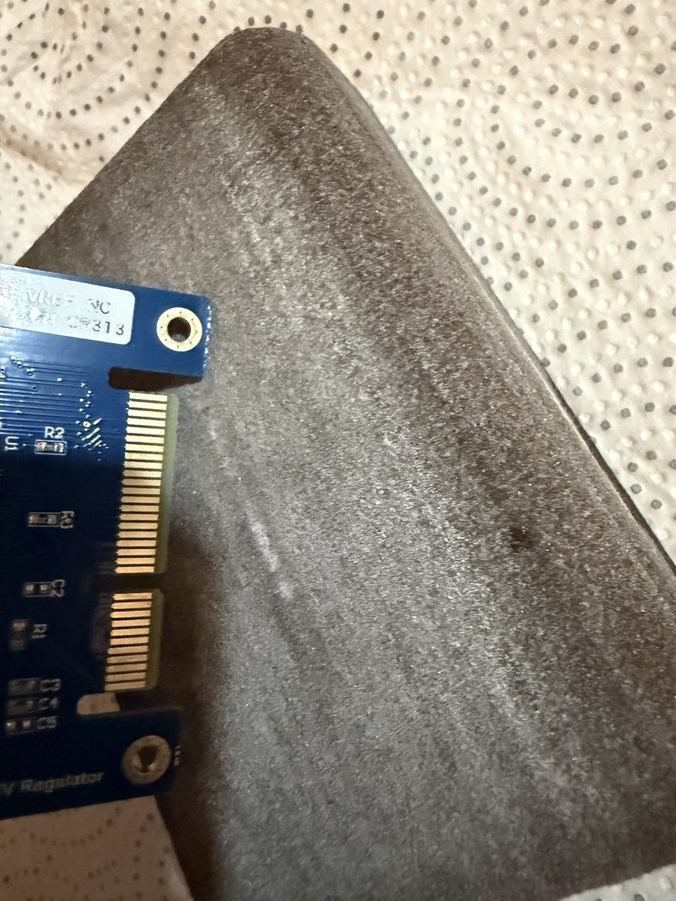

This is roughly how much of the target-board corner to remove:

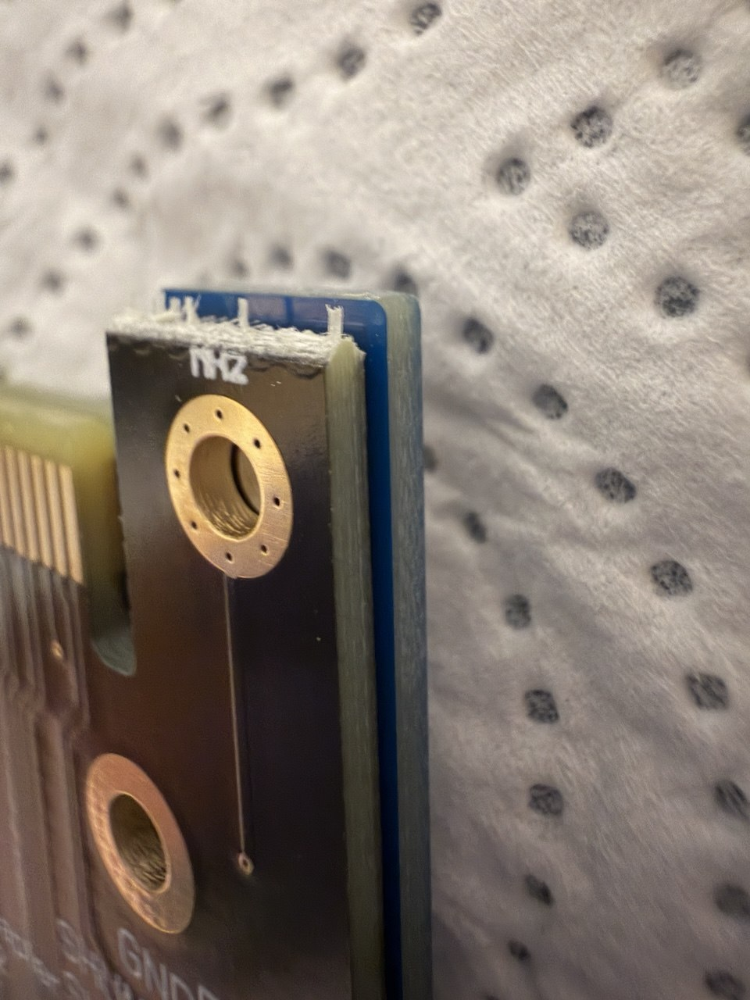

---

## ChipWhisperer validation

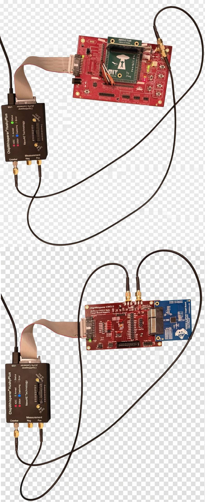

The rest of this document is my own functional testing of the board on real ChipWhisperer hardware, run
one demo at a time through the adapter. The aim is to show that the adapter carries the signals each demo
needs and produces valid side-channel data, not to reproduce the reference notebooks pixel for pixel.
Please read the scope and limitations above before taking any number as more than a single-bench
observation.

- **Date:** 2026-07-18 (standard Abductor, iCE40, K82F); 2026-07-19 (Right-Angle variant).
- **Setup under test:** the **standard Abductor** and, separately, the **Right-Angle** variant, each on
  the CW308 UFO with a CW312T-SAM4S target and a Husky Plus (the full bench is tabulated below).
- **Method:** one demo at a time, each verified before moving on, following the course order starting
  with `sca101`.

## Test bench

Every number in this document comes from this one bench: the hardware below, driving the software
environment below.

| Hardware | Detail |
|---|---|
| Capture | ChipWhisperer **Husky Plus**, USB `2b3e:ace6`, SN `50203220573555303230333230313036` |
| Husky firmware | FW `1.2.0`, FPGA build `2026-05-22 12:13` |
| Carrier | CW308 **UFO** |
| Adapter | **Abductor** CW312 to CW308, **standard variant (non-right-angle)** |
| Target | **CW312T-SAM4S** (Microchip / ex-Atmel SAM4S, ATSAM4S2, Arm Cortex-M4 without FPU), `PLATFORM=CW312_SAM4S` |
| Target clock | `scope.default_setup()` requests 7.37 MHz on HS2 (`scope.io.hs2='clkgen'`); the Husky's clock generator produces 7.363636 MHz (consistent with the `adc_mul=4` ADC rate 29.454545 MHz) |
| ADC | 29.454545 MHz (`adc_mul=4`), 12 bit |

HS2 is the ChipWhisperer high-speed clock output; on the CW308 it reaches the target CLKIN through the
UFO's clock routing.

| Software | Version / value |
|---|---|
| OS | **Ubuntu 26.04 LTS**, kernel `7.0.0-28-generic`, x86_64 |
| chipwhisperer repo | branch `develop`, commit **`3c8e4347507376d88f2e072fd39df28b380dd713`** (`3c8e4347`, 2026-06-17) |
| commit subject | `Wait after setting trace/UARTTtrigger.fe_clock_src` |
| `jupyter` submodule (notebooks) | `fe7e2aa1585798c3a5a6b247f231abe2e2b4a2cd` |
| chipwhisperer package | `6.0.0` (editable install) |
| Python (venv) | `3.12.13`, created with `uv 0.11.29` |
| Python (system) | `3.14.4`, not used because `numpy 1.26.4` ships no 3.14 wheels and did not build from source in this environment |
| numpy | `1.26.4` |
| ARM toolchain | xpack `arm-none-eabi-gcc 13.3.1` |
| SimpleSerial | `SS_VER_1_1` (firmware default for the base target) |
| SAM4S programmer | SAM-BA (`cw.programmers.SAM4SProgrammer`, erase pin `pdic`) |

## Results summary: Abductor vs Right-Angle vs CW313

The same test suite was run through three setups with the same CW312T-SAM4S target and Husky Plus: the
standard **Abductor** (Husky -> CW308 UFO -> Abductor -> SAM4S), a second **Right-Angle Abductor**
hardware variant, and the SAM4S in its native **CW313** baseboard directly (no adapter). The **Abductor
RA** column is that right-angle variant: its PCB traces run a little longer and are routed differently,
so it is a useful check that the extra routing does not degrade anything. Two further targets, a
**CW312T-iCE40UP** FPGA and a **CW312T-K82F** hardware crypto accelerator, were also run through every
setup as completely different target classes; each non-SAM4S target was moved from the Abductor into the
CW313 directly for its reference run.

Abductor evidence is in `validation/img/` and the `*_dump.txt` files; the CW313 reference is in
`validation/img/cw313/`, `validation/img/*_cw313.png` and `*_cw313_dump.txt`. Every capture script accepts
a `cw313` argument to reproduce the reference run.

| Test | Metric | Abductor | Abductor RA | CW313 direct | Verdict |
|---|---|---|---|---|---|
| Bring-up | traces / serial echo | 10/10 · 10/10 | 10/10 · 10/10 | 10/10 · 10/10 | same |
| Bring-up | mean power p2p | 0.57 | 0.68 | 0.62 | ~same |
| CPA (AES) | full key | yes | yes | yes | same |
| CPA | traces to rank 0 (single run) | 30 | 30 | 30 | same (see note) |
| DPA (AES) | full 16-byte key | yes | yes | yes | same |
| Password SPA | recovered | `h0px3` | `h0px3` | `h0px3` | same |
| Password SPA | winner margin | 22x to 24x | 23x to 25x | 23x to 24x | comparable |
| SNR | peak (linear / dB) | 14.1 / 11.5 dB | 14.0 / 11.5 dB | 16.7 / 12.2 dB | CW313 ~18% higher (linear); single estimate each, small degradation not excluded |
| TVLA | max \|t\| (threshold 4.5) | 60.7 | 59.5 | 60.7 | comparable |
| GPIO3 | TIO3 toggles | yes | yes | yes | same |
| SWD debug | DPIDR / Chip ID | `0x2ba01477` / `0x288b07e1` | `0x2ba01477` / `0x288b07e1` | `0x2ba01477` / `0x288b07e1` | identical |
| Full JTAG | TAP IDCODE | `0x4ba00477` | `0x4ba00477` | `0x4ba00477` | identical |
| Voltage glitch HP | optimum (width, offset, ext) | (1950, 2480, 129) | (2000, 2450, 129) | (1950, 2460, 129) | same ext (129); offset differs by ~1 step |
| Voltage glitch HP | bypass rate | 49.5% (200-shot batch) | 90% (36/40 peak, 40 shots) | 40.5% (200-shot batch) | bypasses on all paths (RA is a 40-shot peak, not directly comparable to the 200-shot batch rates; the standard Abductor's comparable peak is 78% to 98%, see Fault injection) |
| Voltage glitch LP | crash vs repeat | rep1 clean, rep>=2 crash | rep1 clean, rep>=2 crash | rep1 clean, rep>=2 crash | same threshold |
| Clock glitch | faults the SAM4S | yes | yes | yes | same |
| LED1/2/3 | blink in sequence | yes | yes | yes | same |
| Memory dump | crowbar send-loop | 601-byte @ (2000, 2480, 2122) | 510-byte @ (1900, 2200, 88), secret leaked | 510-byte @ (2000, 2480, 2122) | same class of fault (probabilistic point; dump length varies) |
| iCE40 AES | known-answer `AES(0,0)` | `66e94bd4...` | `66e94bd4...` | `66e94bd4...` | identical |
| iCE40 CPA | traces to full key | 3000 | 3000 | 3000 | same (single-run convergence) |
| iCE40 TVLA | max \|t\| (threshold 4.5) | 85.0 | 85.8 | 89.3 | comparable |
| iCE40 DFA | full key (round-8, phoenixAES) | 16/16 | 16/16 | 16/16 | same |
| K82F KAT | `AES(2b7e..,00..0f)` | `50fe67cc...` | `50fe67cc...` | `50fe67cc...` | identical |
| K82F TVLA | max \|t\| (threshold 4.5) | 100.6 | 96.0 | 65.8 | all ≫ 4.5 at 8k traces each (large single-run spread) |
| K82F CPA | byte-0 leakage \|rho\| | ~0.10 | ~0.10 | ~0.10 (0.095) | ~same (each \|rho\| has SE ~0.005; the exact tie is coincidental) |
| K82F CPA | full AES key | not recovered (1/16, rigorous disjoint-set) | not recovered (0/16) | not recovered (0/16) | consistent with target, not adapter (single control run; the 1/16 is at most one byte, not a full-key break) |

Verdict key: *identical* = bit/value-exact match for fixed digital quantities (IDCODEs, KATs). *~same* =
point estimates whose difference is within (or smaller than) the available scatter, so a small effect is
neither confirmed nor excluded (SNR, |rho|, p2p). *comparable* = same order of magnitude, differences
consistent with run-to-run variation (TVLA t, margins). *same* = same qualitative pass/fail. Two
result-specific notes on the table: *traces to rank 0* is a single-run, data-dependent convergence count
on a coarse trace grid, not a bit-exact constant and not a guessing-entropy average; it landed at 30 on
all three paths here but can vary run-to-run (see Side channel). For *K82F full AES key*, the mmCAU is an
unprotected accelerator that first-order CPA did not break on any path; the single byte recovered under
the rigorous criterion on the Abductor (1/16, vs 0/16 on the other two) is a marginal one-byte result at
the edge of the method's sensitivity, not a full-key break (see the K82F target).

**Conclusion.** Within this setup and test set, no test resolved a difference between the Abductor and
the SAM4S running directly in a CW313 baseboard beyond single-run scatter, the one exception being the
SNR point estimate, which was in fact slightly *higher* on the direct CW313 path (16.7 vs 14.1 linear;
about 0.7 dB). So this run gives no evidence that the Abductor improves the signal, and with one estimate
per path a small degradation cannot be excluded either (see Signal coverage and integrity). Otherwise the
adapter carried the demonstrated portion of the suite (side channel, fault injection, debug, I/O) with
results consistent with the direct connection: CPA recovers the full key in the same 30 traces; TVLA
max |t| came out at 60.7 on both paths (an exact match to three significant figures that is coincidental,
see Signal coverage and integrity); the fixed debug IDs match bit-for-bit; the glitch optimum lands at the same
ext_offset (129); the 200-shot bypass rates (49.5% Abductor, 40.5% CW313) differ by less than the
measurement can resolve (see Fault injection); and the memory-dump fault lands at the same parameters.
The **Right-Angle** variant behaved the same way, reproducing every key outcome despite its longer,
differently-routed traces (SNR 14.0 vs 14.1, TVLA 59.5 vs 60.7, CPA full key in the same 30 traces,
matching DPIDR and JTAG IDCODE, glitch at the same ext_offset 129, and a memory dump that leaked the
secret). The two other targets stretch the range further: through the Abductor, the iCE40 FPGA fell to
both a hardware-AES CPA and a full `phoenixAES` DFA, while the K82F mmCAU accelerator resisted the
first-order CPA tried here on every path alike. Per-test detail and evidence follow below.

## Primary target: CW312T-SAM4S

The SAM4S is the primary target and gets the deepest workout: a bring-up smoke test, the full `sca101`
side-channel walkthrough, `fault101` voltage and clock glitching, a JTAG/SWD debug takeover, and a
pin-by-pin coverage and signal-integrity check. Each subsection exercises a different set of signals the
Abductor has to route.

### Bring-up: signal chain validation

A smoke test that builds `simpleserial-base`, flashes it over SAM-BA, and captures traces. Each row
exercises a distinct path the Abductor has to route. Script: `validation/scripts/smoke_bringup.py`.

| # | Test | Abductor path exercised | Status | Metric |
|---|---|---|---|---|
| 0 | Connect to Husky Plus | n/a (scope only) | ✅ | `cwhuskyplus`, FW 1.2.0 |
| 1 | Build SAM4S firmware | n/a (host build) | ✅ | `simpleserial-base-CW312_SAM4S.hex`, ROM 2.17% of 128 KB |
| 2 | Flash over SAM-BA (ERASE=`pdic`, `nrst`) | control and reset lines | ✅ | program plus verify OK in 5.0 s |
| 3 | Bidirectional UART (echo of `p` command) | serial TX and RX | ✅ | 10/10 echoes correct |
| 4 | Trigger and capture | trigger and sync | ✅ | 10/10 traces, 5000 samples each |
| 5 | Clock and power measurement | HS2 clock plus shunt/SMA | ✅ | mean per-trace p2p 0.57, global sample std 0.14, clean clock cycles |

The Abductor routed clock, power, serial, ERASE and NRST correctly in this run. The full signal chain
(Husky Plus -> CW308 UFO -> Abductor -> SAM4S) is operational.

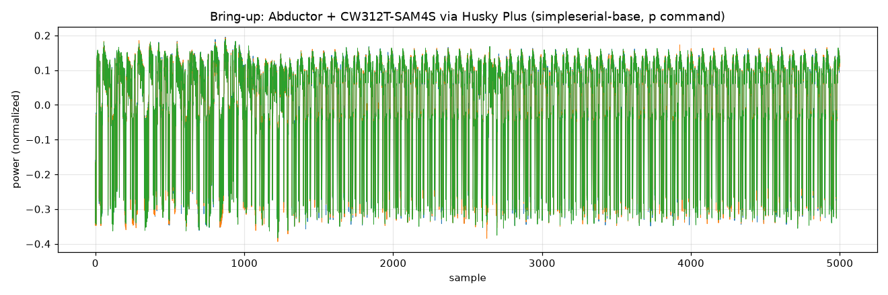

### Side channel (sca101 walkthrough)

The `sca101` course builds up from timing to a full AES key recovery. Every hardware lab passed; the
software-only labs are skipped and marked as such.

| Lab | Title | Firmware | Status |
|---|---|---|---|
| 2_1A | Instruction Power Differences | simpleserial-base | ✅ Pass |
| 2_1B | Power Analysis for Password Bypass | basic-passwdcheck | ✅ Pass |
| 3_1 | Large Hamming Weight Swings | simpleserial-aes (TINYAES128C) | ✅ Pass |
| 3_2 | Recovering Data from a Single Bit | n/a | ⏭️ Skipped (software-only, no hardware) |
| 3_3 | DPA on a Firmware AES Implementation | simpleserial-aes (TINYAES128C) | ✅ Pass (full key) |
| 4_1 | Power and Hamming Weight Relationship | n/a | ⏭️ Skipped (low-impact stepping stone) |
| 4_2 | CPA on a Firmware AES Implementation | simpleserial-aes (TINYAES128C) | ✅ Pass (full key, 30 traces) |
| 4_3 | ChipWhisperer Analyzer CPA Attack | simpleserial-aes | ⏳ Pending |
| 5_1 | ChipWhisperer CPA Attacks in Practice | simpleserial-aes | ⏳ Pending |
| 6_4 | Jittery Triggering on UART | simpleserial-base | ⏳ Pending |

Legend: ✅ pass · ⏳ pending · ⚠️ pass with notes · ❌ fail · ⏭️ skipped (not a hardware test)

#### Lab 2_1A: Instruction Power Differences

Different instruction blocks were inserted between `trigger_high()` and `trigger_low()` in
`simpleserial-base`, then built, flashed and captured. The execution cost of each block is read directly
from the trigger duration (`scope.adc.trig_count`). This counter is in ADC samples, and with `adc_mul=4`
there are 4 samples per core clock cycle, so the counts below are ADC samples (roughly 4x the core-cycle
count), not core cycles. Script: `validation/scripts/lab_2_1A.py`.

| Instruction block | Trigger duration (ADC samples) | Cost vs baseline |
|---|---|---|
| baseline (empty) | 492 | reference |
| 20x `A *= 2` (unrolled multiply) | 992 | +500 (about 25 ADC samples, ~6 core cycles, per volatile statement) |
| loop x20 `A *= 2` (multiply) | 2132 | +1640 (about 82 ADC samples, ~20 core cycles, per iteration) |
| loop x20 `A /= 3` (integer divide, multi-cycle) | 2276 | +1784 (144 more than the multiply loop) |

Findings:

- The sample count was identical across all 15 captures (min equals max), as expected for a
  deterministic trigger counter, and consistent with the count being read back without corruption
  through the Abductor.
- The unrolled block adds a flat per-statement cost. The looped version costs far more than unrolling the
  same 20 multiplies; the extra cost is consistent with per-iteration loop overhead (the volatile counter
  load/store, compare and branch), though this measurement records only the total trigger duration and
  does not isolate those components individually.
- The divide loop is more expensive than the multiply loop. Here `A` is a `volatile long int`, so
  `A /= 3` is integer division, which is more work than the multiply either way: depending on the build
  optimization the compiler emits the multi-cycle Cortex-M4 `SDIV`, or, for a constant divisor like 3, a
  strength-reduced multiply-and-shift sequence. This measurement records only the total trigger duration
  and cannot distinguish the two, so it does not prove an `SDIV` executed; the higher cost is simply
  consistent with integer division costing more than the multiply.

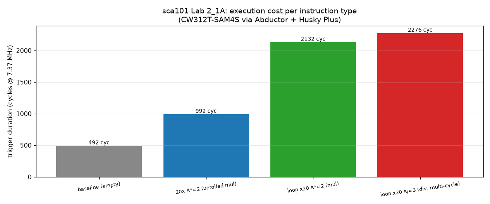

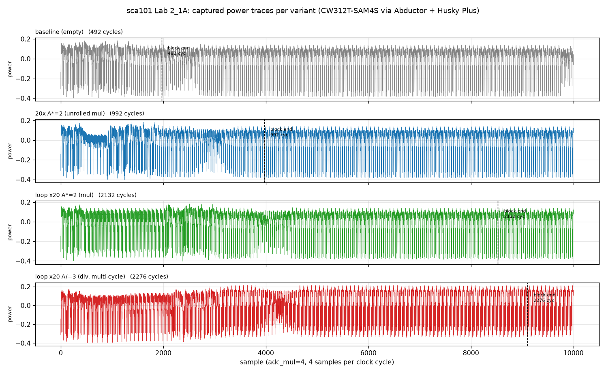

#### Lab 2_1B: Power Analysis for Password Bypass

`basic-passwdcheck` checks a fixed password (`h0px3`) one character at a time and bails on the first wrong
character. Each correct character runs one extra loop iteration, so the power trace stays active longer
before diverging. The attack captures one trace per candidate, scores it against a wrong reference with
SAD (sum of absolute differences), keeps the highest scoring character, then repeats for the next
position using the known prefix. Script: `validation/scripts/lab_2_1B.py`.

| Position | Recovered char | SAD (winner) | SAD (2nd best) | Margin |
|---|---|---|---|---|
| 0 | `h` | 286.6 | 11.9 | 24.0x |
| 1 | `0` | 284.6 | 12.4 | 22.9x |
| 2 | `p` | 280.3 | 12.7 | 22.1x |
| 3 | `x` | 274.5 | 12.4 | 22.1x |
| 4 | `3` | 301.7 | 12.3 | 24.4x |

Recovered password: **`h0px3`**, which matches the firmware constant. (Margins are computed from the
full-precision SAD values, so they may differ slightly from dividing the rounded columns shown here.)

The correct character wins each position by roughly 22x to 24x in SAD, a large and easily separable margin
on these single-trace-per-candidate captures. The divergence figure shows the correct and wrong
first-character traces overlapping until the compared byte, then splitting cleanly around sample 420. The
heatmap shows one bright cell per position, spelling out the password.

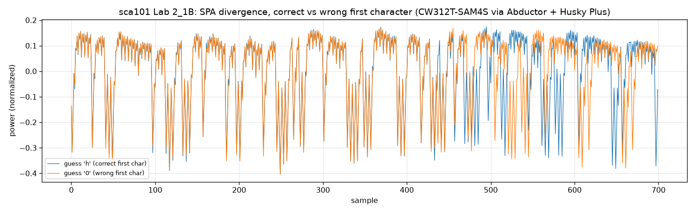

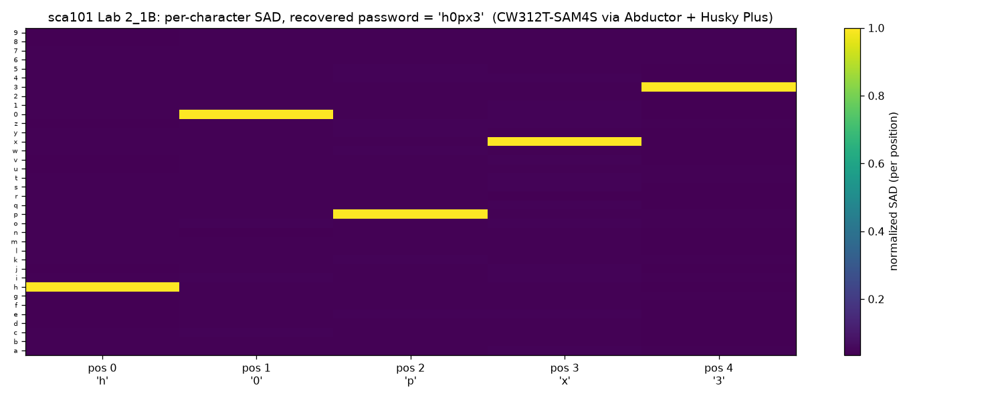

#### Lab 3_1: Large Hamming Weight Swings

This lab shows the target's power depends on the data it manipulates, not only on the code path. With
`simpleserial-aes` (TINYAES128C) running a fixed key, 200 traces were captured while forcing plaintext
byte 0 to either `0x00` (Hamming weight 0) or `0xFF` (Hamming weight 8). In the script each trace's byte 0
is set to `0xFF` or `0x00` according to the parity of the original random byte, which gives a roughly even
split. Averaging each group and subtracting gives the data-dependent leak. Script:
`validation/scripts/lab_3_1.py`.

| Metric | Value |
|---|---|
| Traces | 200 (~100 at 0x00, ~100 at 0xFF, split by the parity of the random byte 0) |
| Peak difference | 0.0254 in magnitude at sample 528 (the value is negative, see the sign note below) |
| Noise floor (std of the difference trace away from the peak) | 0.0008 |
| Leak vs noise | peak difference ~32x the off-peak difference-trace std (informal single-run ratio, not an SNR) |

The difference of means is flat everywhere except a sharp spike at sample 528, where the target loads and
processes that byte. The spike is negative because ChipWhisperer measures across a shunt, so more power
reads as lower voltage, and `0xFF` (more bits set) draws more power than `0x00`. This is the same class of
data-dependent, Hamming-weight leakage that CPA on AES exploits (there through the Hamming weight of the
S-box output, `HW(SBox(pt XOR key))`, rather than the plaintext byte itself).

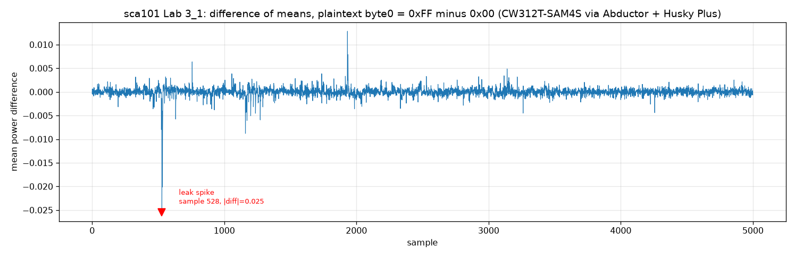

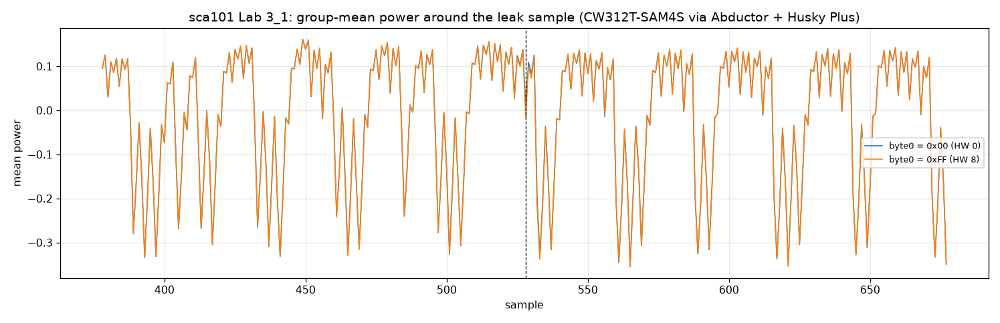

#### Lab 3_3: DPA on a Firmware AES Implementation

This is the first full key recovery in the suite: the complete AES-128 key was recovered from the captured
power traces. With `simpleserial-aes` (TINYAES128C) and a fixed key, 2500 traces were captured (about
119 traces/s) while sending random plaintexts. For each key byte and each of the 256 guesses, the traces
are split by bit 0 of `SBox(plaintext_byte XOR key_guess)` and the difference of the two group means is
computed. The guess whose difference-of-means trace peaks highest is taken as the key byte. Script:
`validation/scripts/lab_3_3.py`.

- Traces: 2500 (fixed key, random plaintext)
- Recovered key: `2b7e151628aed2a6abf7158809cf4f3c`
- Known key: `2b7e151628aed2a6abf7158809cf4f3c`
- Full key match: **yes, all 16 bytes**

For every byte the correct guess peak sits above the best wrong guess. For key byte 0 the correct guess
`0x2b` produces a sharp peak near sample 1900 while wrong guesses stay in the noise. The winner margin is
modest because single-bit DPA is noisier than CPA; the CPA lab below improves on this.

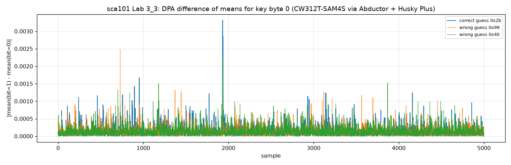

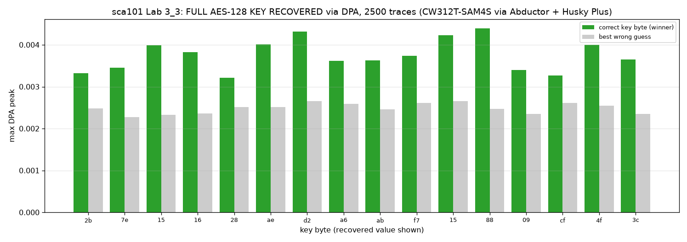

#### Lab 4_2: CPA on a Firmware AES Implementation

Correlation Power Analysis is the stronger attack here because it is less noisy than the single-bit DPA
above. The model is `HW(SBox(plaintext_byte XOR key_guess))`, and for each key byte the guess whose model
has the highest Pearson correlation with the traces is the key byte. Script: `validation/scripts/lab_4_2.py`.

- Traces captured: 1000 (about 120 traces/s)
- Recovered key: `2b7e151628aed2a6abf7158809cf4f3c` (full 16-byte match)
- Correct-byte correlation: about 0.92 to 0.94 in this single 1000-trace run (a single-run point estimate
  that will vary with target and setup)
- Best wrong guess: about 0.20 to 0.31; the correct byte leads the best wrong guess by roughly 0.6 to 0.7
  in absolute |rho|, a wide and unambiguous separation
- Full key first recovered at **~30 traces**: the first grid point where the rank of each of the 16 subkey
  bytes reaches 0 on this single run (coarse trace grid: ...,20,30,40,...). As a single run, not an average
  over many, treat ~30 as an indicative figure, not an averaged guessing-entropy result.

CPA is much cleaner than the single-bit DPA: the correct key stands about 0.6 to 0.7 higher in |rho| than
the best wrong guess, and the whole key falls in a handful of traces. The convergence plot shows the rank
of the correct key dropping to zero by 30 traces.

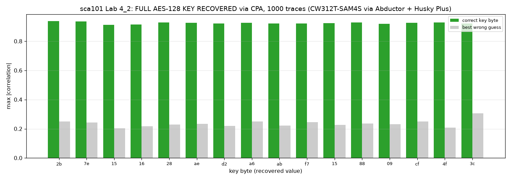

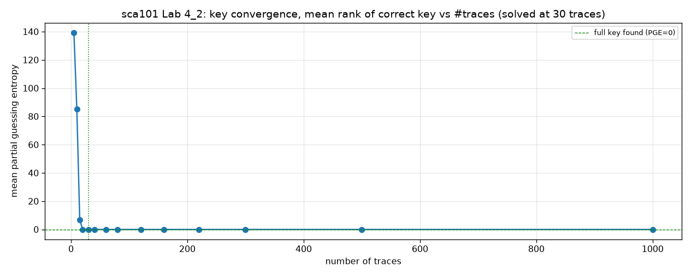

### Fault injection (fault101)

For glitching, the Husky CROWBAR SMA and the MEASURE SMA are both tee'd onto the UFO VOUT node
(voltage-glitch wiring, UFO otherwise at stock jumpers). This exercises the Abductor's crowbar and VOUT
path, a different set of signals from the power measurement used above. All SMA cables used throughout are
the stock cables that ship with the ChipWhisperer Husky Plus and the CW313.

#### Fault 2_2: Voltage Glitching to Bypass a Password Check

`simpleserial-glitch` checks a fixed password ("touch"). Sending a WRONG password (`[0]*5`) normally
returns passok=0. A high-power crowbar voltage glitch during the compare loop can leave passok=1, so the
wrong password is accepted, an authentication bypass. Setup: `scope.vglitch_setup('hp')` with
`scope.io.vglitch_reset()` after each attempt. Script: `validation/scripts/fault_2_2_vglitch_bypass.py`.

- Result: **12 password bypasses in 2964 attempts (about 0.4%)**, wrong password accepted as valid.
- Recurring (12 successes across the run) and tightly localized: **ext_offset 129**, glitch offset 2460 to
  2500, width 1900 to 2140.
- The window is a single ext_offset value, which is why a coarse sweep misses it. Voltage glitching is
  probabilistic and this low rate is expected; it may be narrowed further by the shared VOUT tee and SMA
  cabling, though that was not measured.

The target was faulted through the Abductor crowbar path, so that routing carried the crowbar signal.

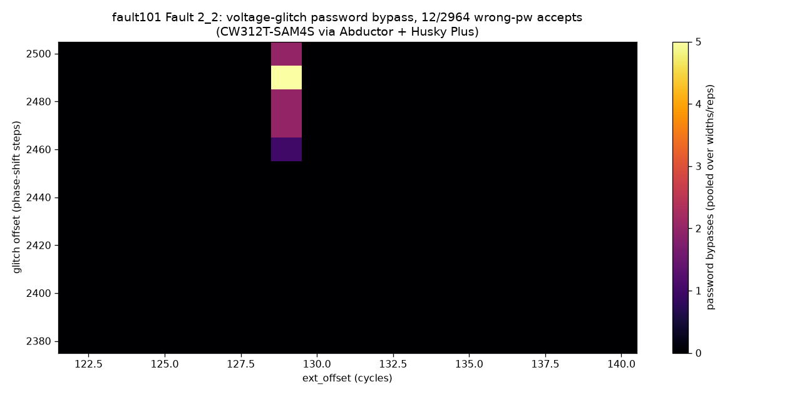

#### Fault 2_3: Voltage Glitching to Memory Dump

`bootloader-glitch` answers a command with an 8-byte ack, sending exactly `ascii_idx` bytes via
`for(i=0; i<ascii_idx; i++) putch(ascii_buffer[i])`. A crowbar glitch on that loop bound makes the target
keep sending past the ack, dumping the adjacent buffer and RAM (including the decrypted `data_buffer`).
Script: `validation/scripts/fault_2_3_memory_dump.py`.

- Glitch: high-power crowbar, width 2000, offset 2480, ext_offset 2122 (inside the send loop,
  trig_count 2159).
- Result: the 8-byte ack became a **601-byte memory dump**: the leftover input buffer plus a block of
  binary RAM. The success marker `767` that this attack scans for is present in the leak (offset 0x2a).
- Success is rare: on the standard board the first success appeared after about 2100 swept attempts, which
  is a single-event sweep position (the ordinal of the one success in an ordered parameter sweep) rather
  than a per-shot hit rate, so treat it as order-of-magnitude only. It is rare because the glitch must land
  on the last loop-bound check (a narrow window) on top of the base glitch rate. The dump length varies with
  the exact glitch (the CW313 produced a 510-byte dump at the same parameters that gave 601 bytes on the
  standard board, and the Right-Angle a 510-byte dump at a different glitch point).

Full hexdump evidence: [`fault_2_3_memory_dump.txt`](validation/evidence/fault_2_3_memory_dump.txt).

#### Clock glitching

In ChipWhisperer's stock configuration the CW312T-SAM4S runs its Cortex-M4 core **directly from the
external HS2 clock**: the SAM4S HAL switches the master clock to MAINCK in bypass mode (`~7.37 MHz`,
prescaler 1) and does not engage the PLLA in the core path. This is visible in
`firmware/mcu/hal/sam4s/sam4s_hal.c` (`osc_enable(OSC_MAINCK_BYPASS)` then
`pmc_switch_mck_to_mainck(SYSCLK_PRES_1)`), and is corroborated by the synchronous 7.363636 MHz capture
clock. A clock glitch on HS2 therefore propagates into the core clock tree (MCK/HCLK) with no PLL to
regenerate it. The matching capture clock is consistent with this bypass configuration but not by itself
proof that no PLL is engaged; the decisive evidence is the HAL source, and that clock glitching in fact
produced faults.

(For reference, on genuinely PLL-clocked systems the PLL strongly attenuates single external-clock
glitches, so a naive single-cycle external glitch is usually ineffective, and faulting instead works by
perturbing the PLL itself, for example by driving it into a transient frequency overshoot through
manipulation of the external reference clock; see Selmke,
Hauschild and Obermaier, "Peak Clock: Fault Injection into PLL-Based Systems via Clock Manipulation,"
ASHES@CCS 2019, Fraunhofer AISEC / ACM, DOI 10.1145/3338508.3359577. That is not the configuration used
here, where the SAM4S core runs on the bare external clock.)

- **Via CW313 direct** (short path, no UFO/Abductor): the clock glitch crashes the SAM4S (crash rate
  rising with glitch width). A single clean password bypass was captured at the crash onset (width 3450,
  offset 2300, ext_offset 142); this was one observed event, so no success rate can be estimated from it.
- **Via UFO + Abductor:** at the same reactive region (width ~3400, offset 2300, ext ~120-140) the glitch
  faults the SAM4S too. The effect scales with `scope.glitch.repeat` (consecutive glitched cycles): the
  crash rate rises with repeat (roughly a few percent at repeat 1 to roughly 40% at repeat 32; single
  sweep), with clean password bypasses at repeat 4, 8 and 16.

A narrower UFO+Abductor sweep earlier missed this exact reactive parameter combination (it swept width
fully but the wrong ext_offset window, or the right ext_offset at the wrong widths), which wrongly
suggested "zero effect" and path attenuation. Testing at the correct parameters shows the Abductor does
fault the SAM4S. These single, unmatched runs cannot establish whether a path effect exists: the
Abductor's clean bypasses appeared only at higher repeat than the one CW313 event, which is suggestive,
but a single uncontrolled CW313 observation cannot confirm it; matched sweeps on both paths would be
needed to decide. Clock glitching this SAM4S was crash-dominated regardless of path, with clean faults
comparatively rare; the practical tip is to use a higher `scope.glitch.repeat` for more frequent clean
faults. Scripts: `validation/scripts/clock_glitch_cw313_bypass.py`,
`validation/scripts/clock_glitch_abductor_repeat.py`.

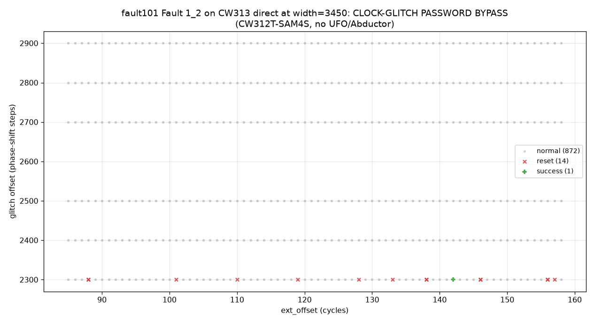

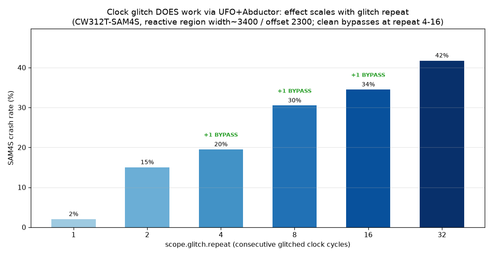

#### Voltage-glitch reliability: connector and path comparison

This measures peak bypass rate at each configuration's best cell (an apparent optimum over the swept grid,
not verified as global): a fine search for the best cell, then 40 attempts there. A bypass means a wrong
password was accepted. Benchmark: `validation/scripts/vglitch_peakrate.py`.

Clean back-to-back comparison on the same freshly re-assembled UFO + Abductor:

| VOUT tee | Peak bypass rate |
|---|---|
| quality tee (Amphenol 132217) | 31/40 = **78%** |
| cheap tee (ships with the UFO) | 22/40 = **55%** |

Other measurements (different re-assemblies, for context): quality tee 39/40 = 98% on an earlier run;
CW313 direct with 2 dedicated SMAs and no tee, 34/40 = 85%. The quality tee is an **Amphenol 132217**
(SMA jack-plug-jack T, Mouser 523-132217); the cheap tee is the one that ships with the CW308 UFO.

A complementary figure is the batch-averaged bypass rate over a larger 200-shot batch (five 40-shot
batches, `validation/scripts/vglitch_rate_robust.py`) at each path's matched same-day optimum: 49.5% on the
UFO plus Abductor and 40.5% on the CW313 direct. That 9-point gap
is about 1.8 standard errors of the difference (SE of the difference ~5%; z ~ 1.8, two-sided p ~ 0.07),
i.e. not resolvable at 200 shots per path. These are the values in the results table above; being
200-shot averages rather than best-cell peaks, they sit below the 40-shot peak rates.

Conclusions:

- **Within this data, the Abductor path is not measurably worse than a direct CW313 connection.** All
  tested configurations produced frequent bypasses (peak rates 55% to 98%, each a single 40-shot run). The
  UFO plus Abductor path with a good tee (78% to 98%) overlaps the direct CW313 connection (85%); all are
  single 40-shot measurements with substantial run-to-run variance, so no path can be ranked above another.
- **The quality tee may help, but the effect is not established.** On a clean back-to-back run the good tee
  gave 78% vs the cheap tee's 55% (31/40 vs 22/40), but a two-sided Fisher exact test on those counts gives only
  p ~ 0.06 (not significant at the 0.05 level), so a single n=40 pair cannot settle whether the tee helps,
  and the difference lies within the run-to-run variance seen elsewhere. It is far smaller than the first,
  uncontrolled numbers suggested (an apparent 40% vs 98%), which were inflated by a grid-edge underestimate
  on one side and by re-assembly variance.
- **Voltage-glitch rates carry real run-to-run and re-assembly variance** (the good tee measured 78% and
  98% on two different re-assemblies), so single 40-shot measurements cannot resolve a modest tee effect
  with certainty; repeated swap-and-measure runs would be needed to pin it down.

Practical takeaway: in these tests the Abductor carried voltage glitching with either tee. The Amphenol
tee is a reasonable low-cost option, not a demonstrated necessity.

### JTAG/SWD debug (halt and memory readout)

Side channel and fault injection cover the power, clock, serial and crowbar paths. The last signal class
the Abductor has to route is the SAM4S debug port. Using the Husky Plus in MPSSE mode (the FTDI emulation
the Husky exposes) together with OpenOCD, the SAM4S was taken over via SWD: the core was reset and halted at its
reset vector, then the chip ID, SRAM, flash and core registers were read out. This exercises the Abductor's
`JTAG_TMS` and `JTAG_TCK` routing (SWDIO and SWCLK).

The Husky drives SWD in non-DIO mode (`scope.enable_MPSSE(1)`), which puts the debug signals on the main
20-pin SPI/PDI pins: **PDID is SWDIO** and **SCK is SWCLK** (the standard ChipWhisperer mapping for the
non-Husky boards). OpenOCD then connects with `transport select swd` and the `at91sam4sXX` target config.

**Reference: CW313 direct (isolation).** The debug flow was first verified on the CW313 baseboard, with
the SAM4S plugged in directly and no Abductor, to confirm the target and the toolchain. On the CW313 the
bridge is made with the on-board **JP3** jumpers (`PDID`/`JTAG_TMS`, `SCK`/`JTAG_TCK`, `nRST`/`JTAG_nRST`),
so no external wiring is needed.

**Through the UFO + Abductor.** The same session was then run through the adapter, the chain being Husky
Plus, CW308 UFO, Abductor, CW312T-SAM4S. The CW308 UFO has no JP3, so the bridge is four wires from the
target-IO header to the UFO JTAG header `J8`:

| Wire | From | To (J8) | Role |
|---|---|---|---|
| 1 | `SCK` | `J_TCK` | SWCLK |
| 2 | `PDID/CS` | `J_TMS` | SWDIO |
| 3 | `VREF` | `J_UREF` | JTAG_VREF for the pull-ups |
| 4 | `nRST` | `J_TRST` | CW reset line jumpered to the JTAG `J_TRST` pin on the UFO JTAG header |

The `VREF` to `J_UREF` wire is not optional. On the CW308 UFO the `JTAG_VREF` net is not driven by the
board (it only feeds the 100k pull-ups on the JTAG lines), so without it the SWDIO idle level floats and
the SWD handshake fails with "cannot read IDR". The CW313 already powers that reference, which is why it
needs no VREF wire. From `J8` the debug lines reach the CPU via the UFO target socket, the Abductor, and
the CW312 edge.

The debug readout through the Abductor is below (the path-invariant part is the fixed silicon and debug-port
identifiers; the vector table and the pc and sp are firmware-dependent, and differ from the CW313 run only
because a different build happened to be loaded there):

| Read over SWD | Value | Meaning |
|---|---|---|
| SWD DPIDR | `0x2ba01477` | ARM CoreSight SW-DP (DPv1) alive, a common DPIDR across ARM Cortex-M3/M4 parts; it identifies the debug port, not the core |
| Core | `Cortex-M4 r0p1` | SAM4S core identified from CPUID |
| State | `halted due to debug-request` | core halted by the debugger immediately out of reset, so it stopped at the reset vector |
| CHIPID_CIDR @0x400E0740 | `0x288b07e1` | chip ID read from silicon (decodes to ATSAM4S2A: Cortex-M4, 128 KB flash, 64 KB SRAM) |
| Flash @0x00400000 | SP `0x200011a8`, reset vector word `0x0040061d` | firmware vector table (the reset entry has bit 0 set for Thumb state, so it points at handler address `0x0040061c`) |
| Registers | pc `0x0040061c`, sp `0x200011a8` | pc matches the reset handler address (the reset vector word `0x0040061d` with its Thumb bit cleared) and sp matches the vector-table MSP, as expected for a reset-halt |

The fixed identifiers read through the Abductor (DPIDR, the CPUID core revision, and the CHIPID) match the
CW313 reference bit for bit, and the halt, flash and register reads behave identically, which is consistent
with the Abductor's JTAG/SWD routing being correct: SWDIO (the TMS-position pin) and SWCLK (the TCK-position pin) carry the
SWD transaction end to end from the CW312 edge to the CW308 socket. The DPIDR identifies an ARM CoreSight
debug port, not the core type; the Cortex-M4 identity comes from the CPUID read (r0p1) and the CHIPID.
This is a full debug takeover (halt, chip ID, SRAM and flash read, core registers) over the adapter. Full
evidence: [`swd_cw313_dump.txt`](validation/evidence/swd_cw313_dump.txt) and [`swd_abductor_dump.txt`](validation/evidence/swd_abductor_dump.txt).

**Full JTAG (TDI and TDO).** SWD uses only two lines, SWDIO and SWCLK, carried on the TMS-position and
TCK-position pins; it does not use the TDI/TDO pins. To also exercise the two remaining debug data lines,
`JTAG_TDI` and `JTAG_TDO`, the session was repeated in full JTAG mode (`transport select jtag`) with two
more wires added on the UFO, `MOSI` to `J_TDI` and `MISO` to `J_TDO` (six wires total). OpenOCD read the
JTAG TAP by scanning the chain, which only completes if the TDI to TDO path through the chip is intact:

| Read over JTAG | Value | Meaning |
|---|---|---|
| TAP IDCODE | `0x4ba00477` (matches expected) | ARM CoreSight JTAG-DP (mfg 0x23b = ARM, part 0xba00, ver 0x4), captured in Capture-DR and read out on TDO by scanning the chain |
| Core | `Cortex-M4 r0p1` | same core, identified from CPUID over JTAG |
| CHIPID_CIDR @0x400E0740 | `0x288b07e1` | chip ID, read over JTAG |

The halt, flash, SRAM and register reads over JTAG shift their commands into the chip through TDI and
return data on TDO, so the JTAG session exercises the Abductor's `JTAG_TDI` (MOSI) and `JTAG_TDO` (MISO)
routing on top of the SWD result (the 32-bit IDCODE itself is captured into the shift register in parallel
and read back on TDO, so it alone confirms TDO, while the reads that follow are what additionally exercise
TDI). The TAP IDCODE
`0x4ba00477` differs from the SWD DP IDR `0x2ba01477`, as expected: they are the identification registers
of the two personalities (JTAG-DP and SW-DP) of the same CoreSight SWJ-DP debug port (the SW-DP DPIDR
carries a DP-version field in bits [15:12] that the
IEEE-1149.1 JTAG IDCODE does not, and encodes PARTNO in 8 bits vs the JTAG format's 16). As noted above,
both are debug-port IDs, not core IDs. So the CW312T-SAM4S is not SWD-only, and every debug line the
Abductor carries is exercised: the data lines TDI and TDO, the control lines TMS and TCK, plus reset
(nRST) and reference (VREF). Evidence: [`jtag_abductor_dump.txt`](validation/evidence/jtag_abductor_dump.txt).

Tooling: OpenOCD 0.12.0, Husky Plus in MPSSE mode (USB PID stays `0xace6`), stock ChipWhisperer interface
config `openocd/cw_openocd.cfg`. Scripts: `validation/scripts/swd_debug.sh`, `validation/scripts/jtag_debug.sh`.

### Signal coverage and integrity

Beyond the main demos, the remaining Abductor-routed signals were checked so each pin the adapter carries
was functionally exercised, continuity-verified, or documented as not applicable (see the coverage matrix),
and the signal path was characterized with two standard leakage-assessment metrics (SNR and TVLA). The functional
tests run small firmwares on the SAM4S (sources under `validation/scripts/firmware/`, runner
`validation/scripts/signal_test.py`); the pin map is taken from the CW312T-SAM4S schematic.

#### Signal integrity (SNR and TVLA)

Two standard leakage-assessment metrics (SNR and TVLA) quantify how cleanly the Abductor's measurement
path captures the AES leakage (`validation/scripts/signal_integrity.py`, 3000-sample window on
`simpleserial-aes`):

- **SNR**: `chipwhisperer.analyzer`'s `calculate_snr` with the S-box (SubBytes) output Hamming-weight model
  (byte 0, 1500 random-plaintext traces) gives a peak **linear SNR of 14.1 (11.5 dB)** at the leak sample,
  i.e. a signal variance about 14 times the noise variance. (Note: in ChipWhisperer's source,
  `calculate_snr(db=True)` returns `20*np.log(snr)`, and `numpy.log` is the natural logarithm, so it
  reports `20*ln(snr)`, which is not standard dB; the dB values quoted here are the proper `10*log10` of
  the linear SNR. See `software/chipwhisperer/analyzer/attacks/snr.py`.)
- **TVLA**: a non-specific fixed-vs-random Welch t-test (the leakage-detection methodology of Goodwill, Jun,
  Jaffe and Rohatgi, 2011, later branded TVLA; ~1500 fixed and ~1500 random traces, 3000 total, split
  fixed-vs-random by a per-trace coin flip) reaches **max |t| = 60.7**, far above the conventional 4.5
  detection threshold. The measurement chain passes the data-dependent leakage through with a large, easily
  detectable signal.

Both metrics were then repeated with the SAM4S in the CW313 baseboard directly (no UFO, no Abductor) as an
A/B reference at the same target and trace count, so that only the signal path differs and any gap points to
the path rather than the target (a raw t-value also grows with the trace count, so it is used here only as a
matched-count relative measure, not as an absolute score):

| Path | SNR peak (linear / dB) | TVLA max \|t\| |
|---|---|---|
| UFO + Abductor | 14.1 / 11.5 dB | 60.7 |
| CW313 direct (reference) | 16.7 / 12.2 dB | 60.7 |

The TVLA max |t| came out at 60.7 on both paths in these single runs; an exact match at three significant
figures across two independent trace sets is coincidental and should not be read as reproducible to that
precision. The point is only that both sit far above the 4.5 threshold with no order-of-magnitude
difference. The SNR differs by about 0.7 dB (11.5 vs 12.2 dB; 14.1 vs 16.7 linear), the direct path being
slightly higher. With only one SNR estimate per path there is no sampling distribution, so this small a
difference cannot be tested at all: the adapter's point estimate is slightly lower and is neither confirmed
nor excluded as a real effect. Confirming the absence (or presence) of a small systematic effect would need
matched repeated sweeps on both paths.

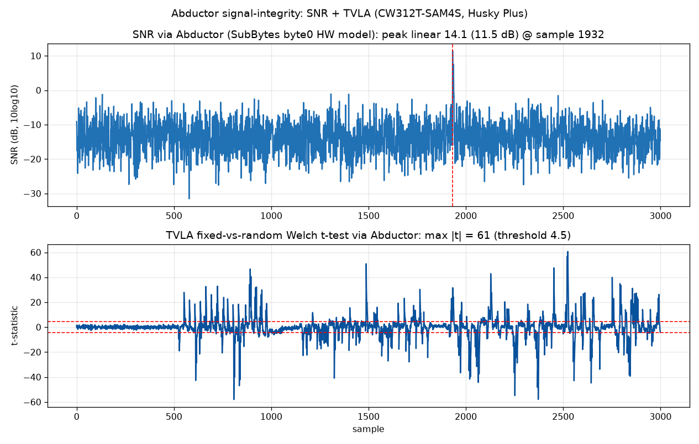

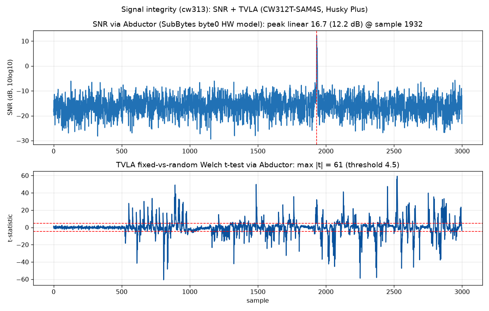

**Possible future work.** The SNR and TVLA figures above are derived from the ChipWhisperer capture path
itself, not from a direct bench measurement of the board. In the future I may probe the Abductor more
directly with my MHO98 and an LD-ASP-2.7 single-ended active probe, to take additional signal-integrity
measurements on both the standard and the Right-Angle Abductor. Any such results would be added here.

#### LED1 / LED2 / LED3 (PA16 / PA15 / PA14)

`led-blink.c` drives the three target LED lines in sequence. All three CW308 LEDs light one after the
other, which confirms the Abductor routes LED1, LED2 and LED3 from the SAM4S to the UFO.

#### GPIO3 (PA8)

`abductor-sigtest.c` drives GPIO3 as a slow square wave. Reading `scope.io.tio_states` on the CW, TIO3
follows it (observed at both 0 and 1), which confirms GPIO3 is routed and that the on-board `SJ1` jumper is
in its GPIO3 position. The same firmware also outputs PCK0 (MAINCK/8) on PA6 = CLK_FROM_SAM (the target
clock-out); the Husky frequency counter does not read the CW308 clock-out path without extra clock-routing
setup, so CLKOUT is confirmed by continuity instead.

#### FILT_LP (low-power crowbar)

The HP crowbar was exercised by the voltage-glitch password bypass above. `fault_2_2_vglitch_lp.py`
exercises the other crowbar transistor with `scope.vglitch_setup('lp')` and sweeps `scope.glitch.repeat`.
The fault is cleanly controlled by the repeat count: no resets were observed at repeat 1 (0 of 18
attempts, a small sample, so a low residual rate is not excluded), and at repeat 2 and above the low-power
crowbar crashed the SAM4S on every attempt in this sweep. The sharp repeat-dependent threshold indicates
the FILT_LP crowbar path reaches the target through the VOUT node, and that the resets track the glitch
parameter rather than occurring at random.

#### Coverage matrix

| Abductor signal | SAM4S pin | Validated by | Status |
|---|---|---|---|
| VCC (1.2 core, 3.3 IO), VREF, SHUNTL/H | power net | SCA / power capture | ✅ |
| CLKIN (HS2) | XIN / PB9 | SCA + clock glitch | ✅ |
| GPIO1_TX / GPIO2_RX | PA10 / PA9 | serial (password bypass) | ✅ |
| GPIO4 / trigger | PA7 | capture trigger | ✅ |
| nRST, PDIC (ERASE) | RST / PB12 | SAM-BA programming | ✅ |
| FILT_HP / VOUT (crowbar HP) | power net | voltage glitch | ✅ |
| JTAG TMS / TCK / TDI / TDO | PB6 / PB7 / PB4 / PB5 | SWD + full JTAG | ✅ |
| JTAG_VREF / JTAG_nRST | debug net | SWD / JTAG (VREF, nRST wires) | ✅ |
| LED1 / LED2 / LED3 | PA16 / PA15 / PA14 | led-blink firmware (visual) | ✅ |
| GPIO3 | PA8 | sigtest firmware (TIO3 read-back) | ✅ |
| CLKOUT (CLK_FROM_SAM) | PA6 (PCK0) | continuity (CW312 edge A29 to UFO CLKOUT) | ✅ |
| FILT_LP (crowbar LP) | power net | low-power crowbar glitch (repeat 1 clean, repeat >=2 crash) | ✅ |
| VCC1.8 / 2.5 / 5.0 / VADJ | power net | continuity (unused by SAM4S) | ✅ |
| HDR1-10, JTAG_TRST | passthrough | continuity | ✅ |
| TRACECLK, TRACED0-3 | not wired to SAM4S (no ETM) | not applicable, see note | N/A |

The SAM4S does not use several routed rails and passthrough pins (the extra VCC rails, HDR1-10, the
differential clock, CLKOUT), so those were confirmed with a continuity check from the CW312 edge to the
CW308 breakout rather than a functional demo. Each checked net was electrically continuous, so the
passthrough routing is connected as intended.

**Parallel trace (TRACECLK, TRACED0-3).** The parallel ETM trace pins are not applicable on this setup, on
both ends. On the target side, the ATSAM4S2 has no ETM and no parallel trace port, so it cannot emit parallel trace (NewAE's own
"Husky TraceWhisperer Exploration" demo states the SAM4S cannot be used for that reason), and the
CW312T-SAM4S schematic shows `TRACECLK` and `TRACED0-3` are not wired to the microcontroller at all (they
are unconnected CW312 edge pins). On the carrier side, the CW308 UFO schematic (a 2016 design) does not
break out trace pins either. So there is no trace path to exercise or even to continuity-check on either
side; this is a target and carrier limitation, not an Abductor issue. The SAM4S's single-wire trace output
(SWO) shares the `TDO/TRACESWO` pin, which is already exercised as `JTAG_TDO` in the full JTAG test above.

## Second target: CW312T-iCE40UP FPGA

To confirm the Abductor works with a completely different class of target, a **CW312T-iCE40UP** (a Lattice
iCE40 UltraPlus iCE40UP5K FPGA, ~5280 LUTs, in a 30-ball WLCSP) was placed in the Abductor in place of the
SAM4S. Unlike the MCU, this target is a hardware AES core in FPGA fabric: it is configured with a bitstream
over SPI, talks over the SS2 wrapper, and leaks on the last AES round. All results below are through the
Abductor, and each was re-run with the iCE40 moved into the CW313 baseboard directly as a reference; the
two setups agree on every attack outcome, with only minor differences in the raw leakage metrics.

- **Bitstream config:** the `iCE40UP5K_SS2` AES bitstream loads and the FPGA configures cleanly, so the
  Abductor routes the FPGA's SPI configuration path (SCK/MOSI/MISO/CS) correctly.
- **AES correctness:** a known-answer test passes (`AES(0, 0) = 66e94bd4ef8a2c3b884cfa59ca342b2e`), so the
  serial (SS2) and clock reach the FPGA and the core runs.
- **CPA key recovery:** with the last-round Hamming-distance model (`cwa.leakage_models.last_round_state_diff`,
  the Hamming distance between the round-9 and round-10 state-register values, valid for this round-based
  single-round-per-cycle core), CPA over **5000 traces** recovers the round-10 key, and the inverse key
  schedule derives the full master key, **16/16 bytes correct** (`2b7e151628aed2a6abf7158809cf4f3c`). This
  needs thousands of traces rather than the ~30 for the SAM4S software AES: in the parallel FPGA core a full
  AES round completes in one clock cycle and all 16 S-boxes switch simultaneously, so the SNR of any single
  targeted byte is far lower (algorithmic noise from the other 15 bytes) than in the byte-serial software
  AES, whose S-box leakage is spread over many cycles. The hardware AES still leaks strongly overall; see
  the TVLA below.
- **Leakage metrics (through the Abductor):** two standard metrics quantify the measurement quality the
  Abductor delivers for this hardware target. **CPA convergence** (same last-round HD model) recovers the
  full 16-byte key at **3000 traces** in this run (8/16 bytes already by 700 traces, 15/16 by 2000), below
  the safe 5000 used above. A non-specific **TVLA** (fixed-vs-random Welch t-test, ~2000 + 2000 traces)
  gives a **max |t| of 85** against the 4.5 detection threshold, so the hardware AES produces a strong
  first-order leakage signal across the Abductor's power path. Plots: `validation/img/ice40_cpa_convergence.png`
  and `validation/img/ice40_tvla.png`; script `validation/scripts/ice40_sca_metrics.py`. *CW313 reference:*
  comparable convergence (full key at **3000 traces**) and a comparable TVLA (**max |t| = 89.3** vs 85.0), so
  the measurement path behaved the same on both setups (`validation/img/cw313/ice40_cpa_convergence.png`,
  `validation/img/cw313/ice40_tvla.png`).
- **Fault injection (full DFA key recovery):** a clock glitch on HS2 (the FPGA's clock) faults the AES core,
  and the fault is exploitable end to end. The attack follows the official ChipWhisperer DFA lab
  (`fault201 Lab 1_3B - DFA Attack on AES`) and uses the same cracker, **`phoenixAES`** (Philippe Teuwen's
  tool, in the JeanGrey repository of the SideChannelMarvels project). Two fault models were used, both first
  validated in software against this FPGA's own ciphertext (`validation/scripts/dfa_selftest.py` reproduces
  the exact bench value `AES(2b7e..,00..0f) = 50fe67cc996d32b6da0937e99bafec60` and the definitive
  known-answer `AES(0,0) = 66e94bd4...`, then recovers the key from simulated faults, so the cracker and the
  fault model are validated in software before any hardware time):
  - *Round-9 (Piret & Quisquater) fault:* a single-byte fault just before the last MixColumns gives a 4-byte
    diagonal ciphertext difference (e.g. bytes 0/7/10/13). This works, but the FPGA runs a **parallel** AES,
    so a fixed plaintext faults only one **data-dependent** diagonal; recovering all four diagonals this way
    was impractical in this campaign (across the limited plaintexts tried, one diagonal did not appear). More
    plaintexts might surface it, so this is not established as impractical in general.
  - *Round-8 fault (the model that succeeded):* a single-byte fault one round earlier fully diffuses, and
    `phoenixAES.convert_r8faults_bytes` expands one such near-fully-corrupted output into a round-9 fault on
    **all four diagonals at once**, so a few clean round-8 faults from just one or two plaintexts are enough.
    In practice the known-answer plaintext yielded 12/16 round-10-key bytes (diagonals 0,1,2) and a second
    plaintext supplied the last diagonal.
  - **Result:** the recovered round-10 key is `d014f9a8c9ee2589e13f0cc8b6630ca6`; inverting the AES key
    schedule (`aes_funcs.key_schedule_rounds(r10, 10, 0)`) gives the master key **`2b7e151628aed2a6abf7158809cf4f3c`,
    16/16 bytes correct**. So the Abductor's clock-glitch path carried a complete differential fault attack on
    the FPGA fabric. Scripts: `validation/scripts/dfa_selftest.py` (software proof) and
    `validation/scripts/ice40_dfa_phoenix.py` (hardware attack); evidence in [`ice40_dfa_abductor.txt`](validation/evidence/ice40_dfa_abductor.txt).
    *CW313 reference:* the same attack on the CW313-direct setup also recovers the full key (16/16, round-8
    route); evidence in [`ice40_dfa_cw313.txt`](validation/evidence/ice40_dfa_cw313.txt).

So for this iCE40 target the Abductor carried everything it needed (SPI config, serial, clock, a clean
enough power measurement for a hardware-AES CPA, and a clock-glitch path strong enough to fully key-recover
the fabric by DFA), the same capability set it provides for the MCU. Script:
`validation/scripts/ice40_hw_aes_cpa.py`.

Note: the SS2 serial only worked once the SAM4S SWD/JTAG jumper wires were removed from the UFO. Those
wires tie `nRST` / `VREF` / SPI to the `J8` JTAG header, which interferes with the FPGA's operation; they
are not needed for any iCE40 test.

## Third target: CW312T-K82F hardware crypto accelerator

To stretch the Abductor to a third, very different class of target, a **CW312T-K82F** (NXP Kinetis
MK82FN256, a Cortex-M4F) was placed in the Abductor in place of the SAM4S. The K82 carries two cryptographic
blocks: the **mmCAU** (Memory-Mapped Cryptographic Acceleration Unit) and the separate **LTC** (LP Trusted
Crypto) co-processor. The firmware tested here attacks the **mmCAU** hardware AES (`CRYPTO_OPTIONS=MMCAU`);
the DPA-mask study further below concerns the LTC engine, a different block. The distinction matters: the
mmCAU is a throughput accelerator for software crypto, with no DPA or side-channel countermeasure of its own
(the K82's hardware DPA countermeasure lives in the LTC), so any non-recovery reported below reflects
measurement effort and low per-byte SNR, not a designed-in resistance. Unlike the SAM4S's plain software AES
and the iCE40's full FPGA AES core, this target runs AES with dedicated on-chip crypto acceleration. All
results are through the Abductor unless a CW313 comparison is given.

- **Bring-up:** the K82F does have an on-chip ROM serial bootloader (KBOOT, entered by pulling PTA4 low, over
  UART/USB), but NewAE recommends flashing this target over **SWD/JTAG**, which is the path used here. It was
  flashed through the Abductor using the Husky's MPSSE mode and OpenOCD (`kx.cfg`), the same debug path the
  SAM4S SWD used (`SWCLK/SWDIO/reset` wired on the UFO `J8`). A known-answer test then passes
  (`AES(2b7e.., 00..0f) = 50fe67cc996d32b6da0937e99bafec60`), so the SWD flash, the 7.37 MHz HS2 clock, the
  LPUART serial, the trigger and the mmCAU-accelerated AES all reach the K82F through the Abductor. Scripts:
  `validation/scripts/k82f_flash.sh`, `validation/scripts/k82f_bringup.py`; firmware in
  `validation/scripts/firmware/k82f/` (built with `PLATFORM=CW308_K82F CRYPTO_TARGET=HWAES
  CRYPTO_OPTIONS=MMCAU SS_VER=SS_VER_2_1`).
- **Leakage present (TVLA):** a non-specific fixed-vs-random Welch t-test on the mmCAU hardware AES gives
  **max |t| = 100.6** (8k traces), far above the 4.5 threshold, so the Abductor's power path clearly captures
  the accelerator's data-dependent activity. Script: `validation/scripts/k82f_tvla.py`.
- **CPA effort:** despite that strong total leakage, the mmCAU hardware AES was **not broken by standard
  first-order CPA** here (up to 50k traces, blind and profiled). With the known key as an oracle, only
  **byte 0 leaks clearly** (`|rho| = 0.104`), bytes 8 and 14 leak weakly (`~0.04-0.06`), and the other twelve
  bytes sit at the noise floor (`~0.02`). A blind full-window CPA returns the correct guess for ~4/16 bytes;
  three of those coincide with the bytes that leak against the known-key oracle (0, 8, 14) and the rest are
  consistent with full-window ghost peaks (random guessing would place only about 0.06 bytes correct out of 16, that is 16 times 1/256, so this is a few
  genuinely leaky bytes plus false positives, not chance). A **rigorous profiled attack with disjoint
  profiling/attack sets** recovers only ~1/16. So the full key was not recovered by any first-order
  correlation attack tried here under this measurement setup; a stronger attacker, a better model, or a higher
  trace budget is not ruled out. (Methodological note: a *self-profiled* matched-filter or POI attack reports
  a false 16/16 because the profile is built from, and then evaluated on, the same traces, with no disjoint
  profiling/attack split, so it overfits that set's noise; the disjoint-set control is what tells the truth.
  Scripts: `validation/scripts/k82f_cpa.py`, `validation/scripts/k82f_leakcheck.py`,
  `validation/scripts/k82f_models.py`, `validation/scripts/k82f_mf_rigor.py`.)
- **Control: target or adapter?** To test whether this non-recovery is a property of the K82F itself and not
  the Abductor degrading the signal, the identical 50k-trace experiment was repeated with the K82F in the
  **CW313** baseboard directly. The two setups match on the outcome: byte-0 `|rho|` **0.104 (Abductor) vs
  0.095 (CW313)**, the same handful of leaky bytes, and neither is broken (full key unrecovered). The CW313
  capture was in fact slightly **noisier** (median 6.1e-3 vs 4.0e-3) with a lower TVLA (65.8 vs 100.6, both at 8k traces), so in
  this session the Abductor did not degrade the measurement relative to the direct path (it was, if anything,
  the cleaner of the two). This points to the non-recovery being a property of the hardware target rather than
  the Abductor, since it persists on the direct CW313 path. Script: `validation/scripts/k82f_compare.py`.
- **DPA countermeasure (inconclusive):** the LTC engine has a hardware DPA mask (`LTC_SetDpaMaskSeed`). The
  mask is seeded at power-on reset; NXP recommends reseeding it every 50000 blocks, but reseeding is
  software-driven, not automatic. Three builds were compared on the same silicon: mask forced constant (off),
  a mask reseeded per NXP's 50000-block recommendation, and a mask reseeded on every encryption. All three
  showed the same |rho| ~ 0.03, with no difference this single-run comparison could resolve (no significance
  test was run), so a first-order difference could not be shown: the measured leakage is dominated by unmasked
  plaintext/ciphertext I/O, and isolating the masked interior would need a middle-round or higher-order attack,
  out of scope here. Scripts: `validation/scripts/k82f_mask_study.py`, `validation/scripts/k82f_mask_variance.py`.

**Three-target picture (power side channel, same Abductor):** software AES on the SAM4S falls in ~30 traces;
the iCE40 FPGA AES fell at roughly 3000 traces in this run (5000 used as a safe margin); the K82F mmCAU
hardware AES was **not broken** by the first-order CPA tried here (up to 50k traces). The Abductor covers a
wide range of attack difficulty across these three targets, and in each case the CW313 control indicates the
Abductor was not the limiting factor.

## Second hardware variant: the Right-Angle Abductor

Everything above uses the standard Abductor. There is a second hardware variant of the same board, the
**Right-Angle Abductor** (abbreviated RA), which mounts the CW312 edge with a right-angle connector. As a
result its PCB traces run a little longer and are routed differently, which could in principle add series
inductance and loop area on the crowbar/VOUT and shunt paths, or slightly reduce measurement bandwidth,
rather than simply attenuate a signal. To check that, **all three targets were re-run through the Right-Angle
board** with the same Husky Plus and CW308 UFO, one test at a time, reconnecting the Husky USB between every
test. Any test that failed on the first attempt was re-run after a fixed recovery step (a USB reconnect);
both the initial failure and the retry outcome are reported. The results populate the **Abductor RA** column
of the results table above. In summary, the Right-Angle Abductor produced results consistent with the
standard Abductor in every test; the small differences observed are of the size expected from run-to-run
variation.

### SAM4S (full suite)

- **Signal integrity is comparable (the key measurement).** The SNR peak is **14.0 (11.5 dB)** versus the
  standard board's 14.1, and the non-specific fixed-vs-random TVLA reaches **max |t| = 59.5** versus 60.7.
  Both differ from the standard board by less than the scatter seen between other single runs, so the longer
  right-angle traces produced no attenuation of the side-channel signal that this run could resolve
  (`validation/img/signal_integrity_ra.png`).
- **Side channel recovers the full key as on the standard board, with comparable margins.** CPA reaches rank 0
  (full 16-byte key) at the same **30 traces**; single-bit DPA recovers all 16 bytes; the Lab 2_1B password SPA
  recovers `h0px3` with a 23x to 25x per-character margin; the Lab 2_1A instruction costs are the same to the
  sample (492 / 992 / 2132 / 2276 ADC samples, min equals max), as expected for deterministic timing; and the
  Lab 3_1 Hamming-weight leak sits at the same sample 528 with a comparable ~27x leak-to-noise ratio.
- **Fault injection works through the right-angle crowbar.** The voltage-glitch password bypass lands at the
  **same optimum window** (`ext_offset 129`, widths 1960 to 2200, offsets 2430 to 2500); a 40-shot peak-rate
  measurement at the optimum gives **36/40 bypasses (90%, 95% CI roughly 76 to 97%)**, overlapping the standard
  board's good-tee range; the low-power FILT_LP crowbar shows the same sharp threshold (no crashes at repeat 1,
  crashes in every attempt at repeat >= 2 over the shots run; a small sample, as on the standard board); the
  clock glitch faults the SAM4S with the crash rate scaling from ~2% at repeat 1 to ~40% at repeat 32 (clean
  password bypasses included); and the Fault 2_3 memory-dump attack **leaked a 510-byte dump containing the
  decrypted secret** ("Don't forget to buy milk!") through the right-angle crowbar ([`fault_2_3_memory_dump_ra.txt`](validation/evidence/fault_2_3_memory_dump_ra.txt)).
- **Debug reads match the reference values.** Over SWD the DP IDR is `0x2ba01477` and the chip ID `0x288b07e1`;
  the full JTAG scan reads the TAP IDCODE `0x4ba00477` (exercising TDI to TDO), halts the core and reads flash
  and registers. The ID and IDCODE reads match byte-for-byte, and the halt/flash/register sequence behaves as
  on the standard board and the CW313 ([`swd_abductor_ra_dump.txt`](validation/evidence/swd_abductor_ra_dump.txt), [`jtag_abductor_ra_dump.txt`](validation/evidence/jtag_abductor_ra_dump.txt)). GPIO3 toggles and the three
  target LEDs blink in sequence, so the IO routing is intact too.

Two caveats from this run. First, one test (Lab 3_1) initially failed to program because the SAM4S did not
drop into its SAM-BA bootloader (the programmer read a garbage ChipID, the known intermittent SAM-BA handshake
issue; see Notes and troubleshooting, where it is also noted to occur on the standard board and the CW313, so
it is unlikely to be Right-Angle-specific); a Husky USB reconnect cleared it and the test passed on the retry.
Second, the Fault 2_3 memory dump landed at a different glitch point than the standard board (`(1900, 2200,
ext 88)` instead of `(2000, 2480, ext 2122)`); for a rare probabilistic fault (its single Right-Angle
success came much later in the sweep than the standard board's) this is consistent with there being
multiple valid glitch points, and the result that matters (a real dump of the secret through
the crowbar) is the same.

**SAM4S conclusion:** the Right-Angle Abductor passed the same SAM4S tests as the standard board. Signal
integrity, side-channel key recovery, voltage and clock fault injection, and SWD/JTAG debug all reproduced,
with any effect of the right-angle connector and its longer traces staying within the run-to-run scatter seen
elsewhere in this SAM4S testing. Scripts are the same as for the standard board with an `ra` label argument
(figures under `validation/img/ra/`); evidence in `validation/img/ra/`,
[`fault_2_3_memory_dump_ra.txt`](validation/evidence/fault_2_3_memory_dump_ra.txt),
[`swd_abductor_ra_dump.txt`](validation/evidence/swd_abductor_ra_dump.txt) and [`jtag_abductor_ra_dump.txt`](validation/evidence/jtag_abductor_ra_dump.txt).

### The other two targets on the Right-Angle: iCE40 FPGA and K82F

The FPGA and the hardware-accelerator targets were then moved into the Right-Angle board as well, so all
three target classes are covered on the variant. Both reproduced their standard-Abductor behavior.

- **iCE40UP5K FPGA.** The bitstream configures and the known-answer test passes (`AES(0,0) = 66e94bd4...`), so
  the SPI config, serial and clock all reach the FPGA through the right-angle board. A hardware-AES **CPA
  recovers the full 16-byte key** (last-round HD model, 16/16), the CPA convergence reaches the full key at
  **3000 traces** and a non-specific **TVLA gives max |t| = 85.8** (versus 85.0 on the standard board), and a
  full **DFA with `phoenixAES` recovers the key 16/16** through a clock glitch on the FPGA clock ([`ice40_dfa_ra.txt`](validation/evidence/ice40_dfa_ra.txt),
  figures under `validation/img/ra/`). One note: the first CPA-convergence run needed 5000 traces for the last
  (weakest) key byte; a repeat then reached the full key at 3000, like the standard board. This is most likely
  run-to-run variation on the weakest byte of a parallel hardware AES, though one repeat cannot rule out a
  Right-Angle effect.
- **K82F hardware crypto accelerator.** It flashes over SWD through the right-angle board (Kinetis MK82FN256
  detected, verified OK) and the known-answer test passes (`AES(2b7e.., 00..0f) = 50fe67cc...`). The TVLA is
  strong (**max |t| = 96.0** at 8k traces, versus 100.6 standard), and the mmCAU accelerator was **not broken by first-order
  CPA, to the same extent as on the standard board**. Capturing 30k traces on the Right-Angle and running the
  same rigorous analysis against the standard-Abductor and CW313 caches (all capped to 30k for a fair
  comparison) gives byte-0 `|rho|` **0.104 (Right-Angle) vs 0.104 (standard Abductor) vs 0.091 (CW313; cf.
  0.095 at the full 50k)**, the full key not recovered by first-order CPA in any of the three within 30k traces
  (rigorous disjoint-set 0/16), and a Right-Angle trace-noise floor of **~4.0e-3, comparable to the standard
  board's ~4.0e-3** (the exact 4.01 vs 4.02 agreement is coincidental) and cleaner than the CW313's 6.11e-3. So
  the non-recovery is the target's, and the right-angle board added no distortion this comparison could
  measure, at a comparable noise floor. Script: `validation/scripts/k82f_ra_compare.py`.

**Overall conclusion.** The Right-Angle Abductor reproduced the key outcomes of the standard board across all
three target classes: the SAM4S software AES (full SCA, fault and debug suite), the iCE40 FPGA hardware AES
(CPA, TVLA and a full DFA), and the K82F mmCAU accelerator (bring-up, TVLA and the same CPA non-recovery at a
comparable noise floor). Across the three target classes tested here, the right-angle connector and its
longer, differently-routed traces showed no effect this testing could measure; every metric agreed with the
standard board within the observed run-to-run variation.

## Reproducing these results

Everything needed to repeat this lives under `validation/`. Run each script in a Python 3.12 environment that
has `chipwhisperer` installed, for example `python validation/scripts/lab_2_1A.py`; the scripts prepend the
xpack ARM toolchain to `PATH` and use `PLATFORM=CW312_SAM4S`. These are working bench scripts, not a polished
package: they contain absolute paths from my own machine (the chipwhisperer repo and firmware locations, the
ARM toolchain directory, and in a few offline analysis scripts a local trace-cache path) and hard-code the
fixed AES key the ChipWhisperer demos use, so adjust those paths for your setup before running.

Bring-up and the `sca101` side-channel labs:

- [`validation/scripts/smoke_bringup.py`](validation/scripts/smoke_bringup.py): build, flash and capture the bring-up smoke test.
- [`validation/scripts/lab_2_1A.py`](validation/scripts/lab_2_1A.py): the Lab 2_1A instruction cost measurement.
- [`validation/scripts/lab_2_1B.py`](validation/scripts/lab_2_1B.py): the Lab 2_1B password bypass SPA attack.
- [`validation/scripts/lab_3_1.py`](validation/scripts/lab_3_1.py): the Lab 3_1 Hamming weight difference of means.
- [`validation/scripts/lab_3_3.py`](validation/scripts/lab_3_3.py): the Lab 3_3 DPA that recovers the full AES-128 key.
- [`validation/scripts/lab_4_2.py`](validation/scripts/lab_4_2.py): the Lab 4_2 CPA that recovers the full AES-128 key and plots convergence.

Fault injection (`fault101`):

- [`validation/scripts/fault_2_2_vglitch_find.py`](validation/scripts/fault_2_2_vglitch_find.py): the Fault 2_2 coarse search that first locates a voltage-glitch bypass.
- [`validation/scripts/fault_2_2_vglitch_bypass.py`](validation/scripts/fault_2_2_vglitch_bypass.py): the Fault 2_2 fine sweep that maps the bypass window.
- [`validation/scripts/fault_2_2_vglitch_lp.py`](validation/scripts/fault_2_2_vglitch_lp.py): the FILT_LP check (low-power crowbar crash rate vs glitch repeat).
- [`validation/scripts/vglitch_peakrate.py`](validation/scripts/vglitch_peakrate.py): peak-rate benchmark (best-cell search + 40-shot peak) used for the clean tee comparison.
- [`validation/scripts/vglitch_rate_robust.py`](validation/scripts/vglitch_rate_robust.py): the 200-shot batch-averaged bypass rate (five 40-shot batches) behind the 49.5% and 40.5% figures.
- [`validation/scripts/fault_2_3_memory_dump.py`](validation/scripts/fault_2_3_memory_dump.py): the Fault 2_3 voltage-glitch memory dump attack (with `fault_2_3_baseline.py`).
- [`fault_2_3_memory_dump.txt`](validation/evidence/fault_2_3_memory_dump.txt): hexdump of the leaked memory dump (601 bytes on the standard Abductor; the RA and CW313 dumps were 510 bytes; the length varies with the glitch).
- [`validation/scripts/clock_glitch_cw313_bypass.py`](validation/scripts/clock_glitch_cw313_bypass.py): clean clock-glitch password bypass on CW313 direct.
- [`validation/scripts/clock_glitch_abductor_repeat.py`](validation/scripts/clock_glitch_abductor_repeat.py): clock glitch via UFO+Abductor with increasing `repeat` (clean bypasses at repeat 4-16).
- [`validation/scripts/clock_glitch_characterize.py`](validation/scripts/clock_glitch_characterize.py), `validation/scripts/clock_glitch_cw313_isolation.py`: earlier clock-glitch parameter sweeps.

JTAG/SWD debug:

- [`validation/scripts/swd_debug.sh`](validation/scripts/swd_debug.sh): SWD halt and memory dump of the SAM4S via Husky MPSSE and OpenOCD (works on the CW313 and through the Abductor).
- [`validation/scripts/jtag_debug.sh`](validation/scripts/jtag_debug.sh): full JTAG version, reads the TAP IDCODE over TDI/TDO, then halts and reads memory.
- [`swd_cw313_dump.txt`](validation/evidence/swd_cw313_dump.txt), [`swd_abductor_dump.txt`](validation/evidence/swd_abductor_dump.txt): OpenOCD SWD readouts, the CW313 reference and through the Abductor.
- [`jtag_abductor_dump.txt`](validation/evidence/jtag_abductor_dump.txt): OpenOCD full-JTAG readout through the Abductor (TAP IDCODE, halt, memory).

Signal coverage and integrity:

- [`validation/scripts/signal_test.py`](validation/scripts/signal_test.py): flash a signal-test firmware and read the signal back over the CW (LED, GPIO3).
- [`validation/scripts/signal_integrity.py`](validation/scripts/signal_integrity.py): SNR (analyzer `calculate_snr`) plus fixed-vs-random TVLA t-test on the Abductor path.
- [`validation/scripts/firmware/led-blink/`](validation/scripts/firmware/led-blink/), `validation/scripts/firmware/abductor-sigtest/`: firmware sources for the LED and GPIO3/CLKOUT signal tests (build under `firmware/mcu/`).

iCE40 FPGA target:

- [`validation/scripts/ice40_hw_aes_cpa.py`](validation/scripts/ice40_hw_aes_cpa.py): hardware AES CPA on the CW312T-iCE40UP FPGA via the Abductor (last-round HD model, recovers the full key from 5000 traces; 3000 was the point this run first reached the full key, 5000 a safe margin).
- [`validation/scripts/dfa_selftest.py`](validation/scripts/dfa_selftest.py): offline proof of the DFA pipeline (software AES cross-checked against the FPGA's own ciphertext, then `phoenixAES` recovers the key from simulated round-9 and round-8 faults). No hardware needed.
- [`validation/scripts/ice40_dfa_phoenix.py`](validation/scripts/ice40_dfa_phoenix.py): the hardware DFA on the iCE40 via the Abductor (clock glitch, round-8 fault collection, `phoenixAES` crack, inverse key schedule to the master key); writes [`ice40_dfa_abductor.txt`](validation/evidence/ice40_dfa_abductor.txt).
- [`ice40_dfa_abductor.txt`](validation/evidence/ice40_dfa_abductor.txt), [`ice40_dfa_cw313.txt`](validation/evidence/ice40_dfa_cw313.txt): DFA evidence (collected round-8 faulty ciphertexts and the recovered round-10/master key, 16/16) for the Abductor and the CW313-direct reference.
- [`validation/scripts/ice40_sca_metrics.py`](validation/scripts/ice40_sca_metrics.py): leakage metrics for the iCE40 hardware AES via the Abductor (CPA convergence, full key at ~3000 traces this run, plus a fixed-vs-random TVLA t-test); saves `validation/img/ice40_cpa_convergence.png` and `validation/img/ice40_tvla.png`.

K82F hardware crypto accelerator:

- [`validation/scripts/k82f_flash.sh`](validation/scripts/k82f_flash.sh), `validation/scripts/k82f_bringup.py`: SWD flash (Husky MPSSE + OpenOCD `kx.cfg`) and known-answer bring-up of the CW312T-K82F hardware crypto accelerator. Firmware under `validation/scripts/firmware/k82f/` (mmCAU AES; LTC mask on / off / active for the DPA-mask study).
- [`validation/scripts/k82f_tvla.py`](validation/scripts/k82f_tvla.py): fixed-vs-random TVLA on the K82F mmCAU hardware AES (max |t|=100.6 Abductor, 65.8 CW313); saves `validation/img/k82f_tvla_*.png`.
- [`validation/scripts/k82f_cpa.py`](validation/scripts/k82f_cpa.py), `validation/scripts/k82f_leakcheck.py`, `validation/scripts/k82f_models.py`, `validation/scripts/k82f_mf_rigor.py`: the CPA effort on the mmCAU (blind, point-of-interest, matched-filter and 32-bit word models). The rigorous disjoint-set result (`k82f_mf_rigor.py`) shows the first-order CPA tried here did not recover the key; saves `validation/img/k82f_mmcau_cpa_convergence.png`. For completeness the repository also includes `k82f_cpa_break.py` and `k82f_mf_convergence.py`, which are deliberately *self-profiled* (the profile is built from the known key and scored on the same traces) and therefore report a false 16/16 by construction; they are kept only as the circular counter-example that the disjoint-set control corrects, and are not evidence of a key recovery.
- [`validation/scripts/k82f_compare.py`](validation/scripts/k82f_compare.py): the control experiment, identical 50k capture on the Abductor vs the CW313 baseboard, indicating the non-recovery is a property of the target, not the adapter.
- [`validation/scripts/k82f_mask_study.py`](validation/scripts/k82f_mask_study.py), `validation/scripts/k82f_mask_variance.py`: the LTC DPA-mask on/off study (inconclusive).

Reference and variant evidence:

- `validation/img/`: the generated figures.
- `validation/img/cw313/`, `validation/img/signal_integrity_cw313.png`, `validation/img/clock_glitch_cw313.png`, [`swd_cw313_dump.txt`](validation/evidence/swd_cw313_dump.txt), [`jtag_cw313_dump.txt`](validation/evidence/jtag_cw313_dump.txt): the CW313-direct reference evidence (see the results table above). Any script takes a `cw313` argument to save its output under `validation/img/cw313/`.
- `validation/img/ra/`, `validation/img/signal_integrity_ra.png`, [`fault_2_3_memory_dump_ra.txt`](validation/evidence/fault_2_3_memory_dump_ra.txt), [`swd_abductor_ra_dump.txt`](validation/evidence/swd_abductor_ra_dump.txt), [`jtag_abductor_ra_dump.txt`](validation/evidence/jtag_abductor_ra_dump.txt): the **Right-Angle Abductor** variant evidence. The SAM4S capture/lab/fault/signal scripts take an `ra` label argument to save figures under `validation/img/ra/` (for example `smoke_bringup.py ra`, `lab_3_3.py ra`, `signal_integrity.py ra`, `fault_2_2_vglitch_bypass.py ra`).
- [`ice40_dfa_ra.txt`](validation/evidence/ice40_dfa_ra.txt), `validation/img/ra/ice40_cpa_convergence.png`, `validation/img/ra/ice40_tvla.png`, `validation/img/k82f_tvla_ra.png`: the iCE40 and K82F evidence on the Right-Angle. The iCE40 scripts (`ice40_hw_aes_cpa.py`, `ice40_sca_metrics.py`, `ice40_dfa_phoenix.py`) and the K82F TVLA (`k82f_tvla.py`) take an `ra` label; `validation/scripts/k82f_ra_compare.py` captures a K82F set on the Right-Angle and compares its CPA non-recovery (byte-0 `|rho|`, blind, rigorous, noise) against the standard Abductor and CW313 caches.

## Notes and troubleshooting

Environment gotchas and the intermittent hardware quirks a rebuilder is likely to hit:

- **Python 3.12 in a venv:** the system ships Python 3.14, where chipwhisperer's pinned `numpy 1.26.4` has no
  3.14 wheels and did not build from source in this environment, so an isolated CPython 3.12 (via `uv`) is used
  instead.
- **Toolchain without sudo:** the ARM GCC toolchain is extracted under the home directory and its `bin` is
  prepended to `PATH` before running `make`.
- **USB permissions:** the stock NewAE udev rule assigns the `chipwhisperer` group and needs a re-login. It was
  switched to `plugdev` (already a member) for immediate access.
- **Lab 2_1A firmware note:** the serial response (`simpleserial_put`) was removed inside `get_pt()`, as the lab
  instructs, so the captured window reflects only the inserted instructions. The framework ack is still consumed
  (`ack=True`) so serial stays in sync.
- **SAM-BA flakiness:** on the AES labs one programming attempt returned a garbage ChipID, which was actually the
  running firmware's UART text leaking into the bootloader handshake (the SAM4S had not dropped into SAM-BA).
  Reconnecting the Husky USB cleared it and programming worked on the first try afterwards. This is the known
  intermittent SAM-BA handshake issue and is not specific to the Abductor; bring-up and Labs 2_1A and 2_1B
  flashed cleanly many times before it, and it also occurs on the standard board and the CW313.
- **SAM-BA pre-reset (memory dump):** flashing `bootloader-glitch` could hang the SAM-BA programmer when a
  previous test had left the SAM4S in a debug-halted or crashed state. Toggling `scope.io.nrst` low then high-Z
  just before `program_target` drops the SAM4S cleanly into its ROM bootloader and avoids the hang;
  `validation/scripts/fault_2_3_memory_dump.py` now does this. With that fix the CW313 memory dump landed a
  510-byte leak at the same `(width 2000, offset 2480, ext_offset 2122)` and a comparable first-success sweep
  position (near 2100 swept attempts) as the Abductor, so the crowbar fault path behaved the same on both.
